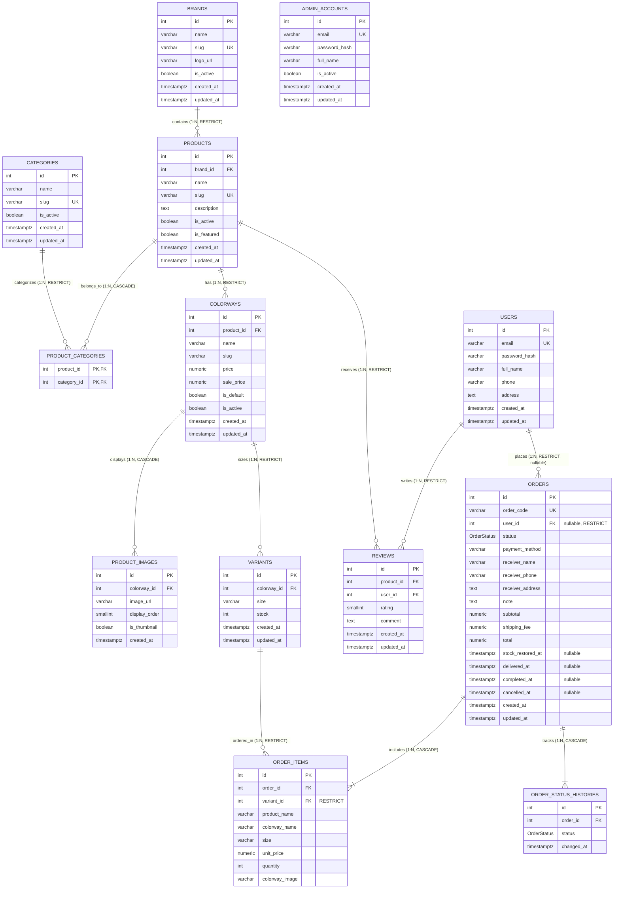

# Database Documentation — Shoe Store WebApp

Tài liệu kỹ thuật phản ánh cấu trúc cơ sở dữ liệu PostgreSQL thực tế đang hoạt động của dự án `shoe-store-webapp`, được quản lý qua Prisma ORM 7 và migration history.

---

## 1. Tổng quan kiến trúc dữ liệu

* **Hệ quản trị CSDL:** PostgreSQL 16
* **ORM:** Prisma 7 (`prisma-client-js`, `@prisma/adapter-pg`, driver `pg`)
* **Tổng số bảng nghiệp vụ:** 13 bảng
* **Quy ước đặt tên:** Model trong code Prisma dùng `PascalCase`, trường dữ liệu dùng `camelCase`; toàn bộ bảng và cột trong PostgreSQL dùng `snake_case` thông qua ánh xạ `@@map` và `@map`.
* **Kiểu tiền tệ:** Toàn bộ các trường tiền tệ sử dụng kiểu số học chính xác `NUMERIC(12, 0)` (VND), không dùng số thực dấu phẩy động (floating point).
* **Ghi chú về `@updatedAt`:** Thuộc tính `@updatedAt` trong Prisma Schema kích hoạt hành vi tự động cập nhật thời gian ở tầng Prisma Client khi thao tác qua ORM, đây không phải là trigger cấp PostgreSQL. Mọi câu lệnh SQL thuần (`raw SQL`) trong tương lai cần tự cập nhật cột `updated_at` nếu có thay đổi dữ liệu.

---

## 2. Danh mục 13 bảng nghiệp vụ (Data Dictionary)

### Nhóm Catalog

#### 1. `brands`
Quản lý các thương hiệu giày trong cửa hàng (Nike, Adidas, Converse, Puma, New Balance...).

| Tên cột | Kiểu dữ liệu | Nullable | Mặc định | Ràng buộc |
| :--- | :--- | :---: | :--- | :--- |
| `id` | `SERIAL` (INT) | NO | Auto-increment | PK |
| `name` | `VARCHAR(100)` | NO | | |
| `slug` | `VARCHAR(100)` | NO | | UNIQUE |
| `logo_url` | `VARCHAR(255)` | YES | NULL | |
| `is_active` | `BOOLEAN` | NO | `true` | |
| `created_at` | `TIMESTAMPTZ` | NO | `CURRENT_TIMESTAMP` | |
| `updated_at` | `TIMESTAMPTZ` | NO | | Prisma `@updatedAt` |

#### 2. `categories`
Quản lý danh mục sản phẩm (Lifestyle, Running, Streetwear, Classic...).

| Tên cột | Kiểu dữ liệu | Nullable | Mặc định | Ràng buộc |
| :--- | :--- | :---: | :--- | :--- |
| `id` | `SERIAL` (INT) | NO | Auto-increment | PK |
| `name` | `VARCHAR(100)` | NO | | |
| `slug` | `VARCHAR(100)` | NO | | UNIQUE |
| `is_active` | `BOOLEAN` | NO | `true` | |
| `created_at` | `TIMESTAMPTZ` | NO | `CURRENT_TIMESTAMP` | |
| `updated_at` | `TIMESTAMPTZ` | NO | | Prisma `@updatedAt` |

#### 3. `products`
Mẫu giày ở cấp sản phẩm (VD: Nike Air Max 90).

| Tên cột | Kiểu dữ liệu | Nullable | Mặc định | Ràng buộc |
| :--- | :--- | :---: | :--- | :--- |
| `id` | `SERIAL` (INT) | NO | Auto-increment | PK |
| `brand_id` | `INTEGER` | NO | | FK `brands(id)` ON DELETE RESTRICT |
| `name` | `VARCHAR(200)` | NO | | |
| `slug` | `VARCHAR(200)` | NO | | UNIQUE |
| `description` | `TEXT` | YES | NULL | |
| `is_active` | `BOOLEAN` | NO | `true` | |
| `is_featured` | `BOOLEAN` | NO | `false` | |
| `created_at` | `TIMESTAMPTZ` | NO | `CURRENT_TIMESTAMP` | Index DESC (New Arrivals) |
| `updated_at` | `TIMESTAMPTZ` | NO | | Prisma `@updatedAt` |

#### 4. `product_categories`
Bảng trung gian thể hiện quan hệ Many-to-Many giữa `products` và `categories`.

| Tên cột | Kiểu dữ liệu | Nullable | Mặc định | Ràng buộc |
| :--- | :--- | :---: | :--- | :--- |
| `product_id` | `INTEGER` | NO | | PK, FK `products(id)` ON DELETE CASCADE |
| `category_id` | `INTEGER` | NO | | PK, FK `categories(id)` ON DELETE RESTRICT, Index |

#### 5. `colorways`
Phối màu của sản phẩm. Nắm giữ giá bán, giá sale và cờ màu đại diện mặc định.

| Tên cột | Kiểu dữ liệu | Nullable | Mặc định | Ràng buộc |
| :--- | :--- | :---: | :--- | :--- |
| `id` | `SERIAL` (INT) | NO | Auto-increment | PK |
| `product_id` | `INTEGER` | NO | | FK `products(id)` ON DELETE RESTRICT |
| `name` | `VARCHAR(100)` | NO | | |
| `slug` | `VARCHAR(100)` | NO | | UNIQUE kết hợp `(product_id, slug)` |
| `price` | `NUMERIC(12, 0)` | NO | | `CHECK ("price" > 0)` |
| `sale_price` | `NUMERIC(12, 0)` | YES | NULL | `CHECK ("sale_price" IS NULL OR ("sale_price" > 0 AND "sale_price" < "price"))` |
| `is_default` | `BOOLEAN` | NO | `false` | Partial UNIQUE Index `(product_id) WHERE is_default = TRUE` |
| `is_active` | `BOOLEAN` | NO | `true` | |
| `created_at` | `TIMESTAMPTZ` | NO | `CURRENT_TIMESTAMP` | |
| `updated_at` | `TIMESTAMPTZ` | NO | | Prisma `@updatedAt` |

#### 6. `product_images`
Bộ ảnh (3–4 ảnh) của phối màu. Không lưu `thumbnail_url` ở Colorway để tránh dư thừa dữ liệu.

| Tên cột | Kiểu dữ liệu | Nullable | Mặc định | Ràng buộc |
| :--- | :--- | :---: | :--- | :--- |
| `id` | `SERIAL` (INT) | NO | Auto-increment | PK |
| `colorway_id` | `INTEGER` | NO | | FK `colorways(id)` ON DELETE CASCADE |
| `image_url` | `VARCHAR(255)` | NO | | |
| `display_order` | `SMALLINT` | NO | `1` | UNIQUE kết hợp `(colorway_id, display_order)` |
| `is_thumbnail` | `BOOLEAN` | NO | `false` | Partial UNIQUE Index `(colorway_id) WHERE is_thumbnail = TRUE` |
| `created_at` | `TIMESTAMPTZ` | NO | `CURRENT_TIMESTAMP` | |

#### 7. `variants`
Biến thể bán thực tế theo kích cỡ giày (chuẩn hóa EU 36–44) và số lượng tồn kho.

| Tên cột | Kiểu dữ liệu | Nullable | Mặc định | Ràng buộc |
| :--- | :--- | :---: | :--- | :--- |
| `id` | `SERIAL` (INT) | NO | Auto-increment | PK |
| `colorway_id` | `INTEGER` | NO | | FK `colorways(id)` ON DELETE RESTRICT |
| `size` | `VARCHAR(10)` | NO | | UNIQUE kết hợp `(colorway_id, size)` |
| `stock` | `INTEGER` | NO | `0` | `CHECK ("stock" >= 0)` |
| `created_at` | `TIMESTAMPTZ` | NO | `CURRENT_TIMESTAMP` | |
| `updated_at` | `TIMESTAMPTZ` | NO | | Prisma `@updatedAt` |

---

### Nhóm Accounts

#### 8. `users`
Tài khoản khách hàng thành viên (Member). Khách vãng lai (Guest) không có bản ghi trong bảng này.

| Tên cột | Kiểu dữ liệu | Nullable | Mặc định | Ràng buộc |
| :--- | :--- | :---: | :--- | :--- |
| `id` | `SERIAL` (INT) | NO | Auto-increment | PK |
| `email` | `VARCHAR(150)` | NO | | UNIQUE (dùng đăng nhập) |
| `password_hash` | `VARCHAR(255)` | NO | | |
| `full_name` | `VARCHAR(100)` | NO | | |
| `phone` | `VARCHAR(20)` | NO | | |
| `address` | `TEXT` | YES | NULL | |
| `created_at` | `TIMESTAMPTZ` | NO | `CURRENT_TIMESTAMP` | |
| `updated_at` | `TIMESTAMPTZ` | NO | | Prisma `@updatedAt` |

#### 9. `admin_accounts`
Tài khoản quản trị viên hệ thống. Độc lập hoàn toàn với khách hàng, không sử dụng Role enum.

| Tên cột | Kiểu dữ liệu | Nullable | Mặc định | Ràng buộc |
| :--- | :--- | :---: | :--- | :--- |
| `id` | `SERIAL` (INT) | NO | Auto-increment | PK |
| `email` | `VARCHAR(150)` | NO | | UNIQUE (dùng đăng nhập) |
| `password_hash` | `VARCHAR(255)` | NO | | |
| `full_name` | `VARCHAR(100)` | NO | | |
| `is_active` | `BOOLEAN` | NO | `true` | |
| `created_at` | `TIMESTAMPTZ` | NO | `CURRENT_TIMESTAMP` | |
| `updated_at` | `TIMESTAMPTZ` | NO | | Prisma `@updatedAt` |

---

### Nhóm Orders

#### 10. `orders`
Quản lý đơn đặt hàng cho cả khách vãng lai (Guest) và thành viên (Member).

| Tên cột | Kiểu dữ liệu | Nullable | Mặc định | Ràng buộc |
| :--- | :--- | :---: | :--- | :--- |
| `id` | `SERIAL` (INT) | NO | Auto-increment | PK |
| `order_code` | `VARCHAR(50)` | NO | | UNIQUE (tra cứu công khai) |
| `user_id` | `INTEGER` | YES | NULL | FK `users(id)` ON DELETE RESTRICT |
| `status` | `OrderStatus` | NO | `'PENDING'` | PostgreSQL Enum: 6 trạng thái |
| `payment_method` | `VARCHAR(20)` | NO | `'COD'` | `CHECK ("payment_method" = 'COD')` |
| `receiver_name` | `VARCHAR(100)` | NO | | |
| `receiver_phone` | `VARCHAR(20)` | NO | | Dùng kết hợp tra cứu đơn |
| `receiver_address` | `TEXT` | NO | | |
| `note` | `TEXT` | YES | NULL | |
| `subtotal` | `NUMERIC(12, 0)` | NO | | `CHECK ("subtotal" >= 0)` |
| `shipping_fee` | `NUMERIC(12, 0)` | NO | | `CHECK ("shipping_fee" >= 0)` |
| `total` | `NUMERIC(12, 0)` | NO | | `CHECK ("total" = "subtotal" + "shipping_fee")` |
| `stock_restored_at` | `TIMESTAMPTZ` | YES | NULL | Cờ hoàn tồn kho idempotent |
| `delivered_at` | `TIMESTAMPTZ` | YES | NULL | Mốc 48 giờ tự chuyển Completed |
| `completed_at` | `TIMESTAMPTZ` | YES | NULL | Mốc tính doanh thu Dashboard |
| `cancelled_at` | `TIMESTAMPTZ` | YES | NULL | Mốc hủy đơn |
| `created_at` | `TIMESTAMPTZ` | NO | `CURRENT_TIMESTAMP` | Mốc KPI đơn hôm nay |
| `updated_at` | `TIMESTAMPTZ` | NO | | Prisma `@updatedAt` |

* **Phân biệt Guest Order vs Member Order:**
  * `user_id IS NULL`: Guest Order (đặt không đăng nhập, không có lịch sử tài khoản).
  * `user_id IS NOT NULL`: Member Order (gắn vào tài khoản của khách hàng).
  * Ràng buộc FK sử dụng `ON DELETE RESTRICT` (không dùng `SET NULL`) để ngăn chặn việc xóa tài khoản biến các đơn hàng lịch sử thành đơn Guest.
* **Mục đích của `stock_restored_at`:**
  * Đảm bảo tính **Idempotent** khi hủy đơn hàng. Khi hủy đơn, câu lệnh UPDATE có điều kiện `WHERE stock_restored_at IS NULL`. Chỉ request đầu tiên chuyển `stock_restored_at = NOW()` mới được phép hoàn tồn kho vào Variant, ngăn chặn hoàn toàn việc hoàn lặp tồn kho khi retry request.

#### 11. `order_items`
Chi tiết món hàng trong đơn. Lưu snapshot cố định tại thời điểm mua, độc lập với việc thay đổi catalog về sau.

| Tên cột | Kiểu dữ liệu | Nullable | Mặc định | Ràng buộc |
| :--- | :--- | :---: | :--- | :--- |
| `id` | `SERIAL` (INT) | NO | Auto-increment | PK |
| `order_id` | `INTEGER` | NO | | FK `orders(id)` ON DELETE CASCADE, Index |
| `variant_id` | `INTEGER` | NO | | FK `variants(id)` ON DELETE RESTRICT |
| `product_name` | `VARCHAR(200)` | NO | | Snapshot tên sản phẩm lúc mua |
| `colorway_name` | `VARCHAR(100)` | NO | | Snapshot tên màu lúc mua |
| `size` | `VARCHAR(10)` | NO | | Snapshot kích thước lúc mua |
| `unit_price` | `NUMERIC(12, 0)` | NO | | Snapshot giá thực trả, `CHECK ("unit_price" > 0)` |
| `quantity` | `INTEGER` | NO | | `CHECK ("quantity" > 0)` |
| `colorway_image` | `VARCHAR(255)` | YES | NULL | Snapshot ảnh đại diện lúc mua |

*(Lưu ý: Không lưu cột `subtotal` tại đây, thành tiền từng dòng tính toán theo `unit_price * quantity`).*

#### 12. `order_status_histories`
Lưu timeline lịch sử chuyển trạng thái của đơn hàng theo đặc tả.

| Tên cột | Kiểu dữ liệu | Nullable | Mặc định | Ràng buộc |
| :--- | :--- | :---: | :--- | :--- |
| `id` | `SERIAL` (INT) | NO | Auto-increment | PK |
| `order_id` | `INTEGER` | NO | | FK `orders(id)` ON DELETE CASCADE |
| `status` | `OrderStatus` | NO | | PostgreSQL Enum: 6 trạng thái |
| `changed_at` | `TIMESTAMPTZ` | NO | `CURRENT_TIMESTAMP` | Index kết hợp `(order_id, changed_at)` |

---

### Nhóm Reviews

#### 13. `reviews`
Đánh giá sản phẩm của Member sau khi đã có đơn hàng hoàn thành (`COMPLETED`).

| Tên cột | Kiểu dữ liệu | Nullable | Mặc định | Ràng buộc |
| :--- | :--- | :---: | :--- | :--- |
| `id` | `SERIAL` (INT) | NO | Auto-increment | PK |
| `product_id` | `INTEGER` | NO | | FK `products(id)` ON DELETE RESTRICT |
| `user_id` | `INTEGER` | NO | | FK `users(id)` ON DELETE RESTRICT |
| `rating` | `SMALLINT` | NO | | `CHECK ("rating" >= 1 AND "rating" <= 5)` |
| `comment` | `TEXT` | NO | | |
| `created_at` | `TIMESTAMPTZ` | NO | `CURRENT_TIMESTAMP` | |
| `updated_at` | `TIMESTAMPTZ` | NO | | Prisma `@updatedAt` |

* Ràng buộc: `UNIQUE ("product_id", "user_id")` bảo đảm đúng quy tắc nghiệp vụ: **1 Member + 1 Product = tối đa 1 Review**.

---

## 3. PostgreSQL Enums

### `OrderStatus`
Enum cấp cơ sở dữ liệu định nghĩa 6 trạng thái đơn hàng bất biến:
* `'PENDING'` (Chờ xử lý)
* `'PREPARING'` (Đang chuẩn bị hàng)
* `'SHIPPING'` (Đang giao hàng)
* `'DELIVERED'` (Đã giao hàng)
* `'COMPLETED'` (Hoàn tất — tính doanh thu & mở review)
* `'CANCELLED'` (Đã hủy — hoàn tồn kho 1 lần)

---

## 4. Danh sách Constraints & Indexes

### A. Ràng buộc toàn vẹn khóa ngoại (Foreign Key Delete Actions)
* `Brand -> Product`: `ON DELETE RESTRICT`
* `Product -> ProductCategory`: `ON DELETE CASCADE`
* `Category -> ProductCategory`: `ON DELETE RESTRICT`
* `Product -> Colorway`: `ON DELETE RESTRICT`
* `Colorway -> ProductImage`: `ON DELETE CASCADE`
* `Colorway -> Variant`: `ON DELETE RESTRICT`
* `Variant -> OrderItem`: `ON DELETE RESTRICT` (Variant đã bán không bao giờ được hard delete)
* `User -> Order`: `ON DELETE RESTRICT` (Bảo vệ Member Order lịch sử)
* `Order -> OrderItem`: `ON DELETE CASCADE`
* `Order -> OrderStatusHistory`: `ON DELETE CASCADE`
* `Product -> Review`: `ON DELETE RESTRICT`
* `User -> Review`: `ON DELETE RESTRICT`

### B. Ràng buộc kiểm tra (CHECK Constraints)
1. `chk_colorways_price`: `CHECK ("price" > 0)`
2. `chk_colorways_sale_price`: `CHECK ("sale_price" IS NULL OR ("sale_price" > 0 AND "sale_price" < "price"))`
3. `chk_variants_stock`: `CHECK ("stock" >= 0)`
4. `chk_orders_subtotal`: `CHECK ("subtotal" >= 0)`
5. `chk_orders_shipping_fee`: `CHECK ("shipping_fee" >= 0)`
6. `chk_orders_total`: `CHECK ("total" = "subtotal" + "shipping_fee")`
7. `chk_orders_payment_method`: `CHECK ("payment_method" = 'COD')`
8. `chk_order_items_unit_price`: `CHECK ("unit_price" > 0)`
9. `chk_order_items_quantity`: `CHECK ("quantity" > 0)`
10. `chk_reviews_rating`: `CHECK ("rating" >= 1 AND "rating" <= 5)`

### C. Chỉ mục duy nhất có điều kiện (Partial Unique Indexes)
1. `uq_colorway_default`:
   ```sql
   CREATE UNIQUE INDEX "uq_colorway_default" ON "colorways"("product_id") WHERE "is_default" = TRUE;
   ```
   *(Đảm bảo trong mỗi Product có tối đa 1 phối màu đại diện mặc định).*
2. `uq_product_image_thumbnail`:
   ```sql
   CREATE UNIQUE INDEX "uq_product_image_thumbnail" ON "product_images"("colorway_id") WHERE "is_thumbnail" = TRUE;
   ```
   *(Đảm bảo trong mỗi Colorway có tối đa 1 ảnh đại diện thumbnail).*

### D. Các chỉ mục tối ưu truy vấn (B-Tree Indexes)
* `products(brand_id)`: lọc sản phẩm theo Brand.
* `products(created_at DESC)`: hiển thị mục New Arrivals và sắp xếp mới nhất.
* `product_categories(category_id)`: lọc sản phẩm theo Category.
* `orders(user_id)`: danh sách đơn hàng của tôi cho Member.
* `orders(status)`: lọc đơn theo trạng thái trong quản trị Admin.
* `orders(created_at)`: KPI số đơn hôm nay cho Dashboard.
* `orders(completed_at)`: thống kê doanh thu theo ngày/tuần/tháng cho Dashboard.
* `order_items(order_id)`: load chi tiết sản phẩm của đơn hàng.
* `order_status_histories(order_id, changed_at)`: load timeline lịch sử đơn hàng.

---

## 5. Sơ đồ thực thể quan hệ (Mermaid ERD)


