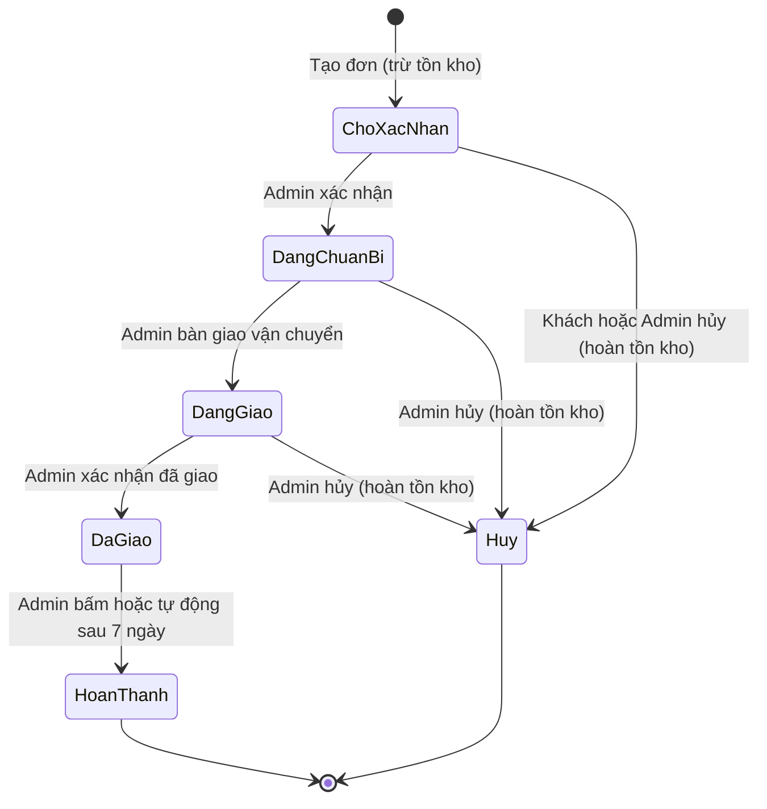
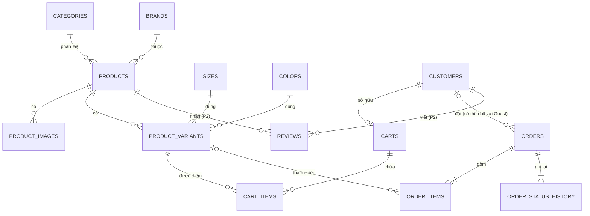

# TÀI LIỆU NGHIỆP VỤ: WEBSITE BÁN GIÀY TRỰC TUYẾN

| | |
|---|---|
| Phiên bản | v3.1 (viết lại từ v2, đã bổ sung góp ý rà soát: công thức tiền, slug, ảnh, phiên đăng nhập, rate limit) |
| Nguồn gốc | Đề tài dự án môn Lập trình web, PTIT: "Xây dựng website thương mại điện tử bán giày" |
| Đối tượng đọc | Nhóm phát triển và AI coding agent (Codex) |
| Quy ước | "phải" = bắt buộc; "không được" = cấm; "nên" = khuyến khích, có thể bỏ nếu thiếu thời gian |

Mọi quy tắc có mã (ví dụ `DH-05`) để tham chiếu trong file plan và test. Nếu tài liệu này mâu thuẫn với ý định của người dùng, agent phải dừng lại và hỏi, không tự đoán.

---

## 1. Tổng quan và phạm vi

### 1.1 Mục tiêu
- Cung cấp kênh bán giày trực tuyến cho một cửa hàng đơn lẻ.
- Cho phép khách mua hàng nhanh (không cần tài khoản) hoặc mua qua tài khoản thành viên.
- Cho phép quản trị viên quản lý sản phẩm, tồn kho, đơn hàng, khách hàng và xem thống kê doanh thu.
- Hệ thống chạy được hoàn chỉnh bằng Docker và triển khai được lên hosting/VPS thật.

### 1.2 Phạm vi theo giai đoạn

| Giai đoạn | Nội dung |
|---|---|
| **P1 (bắt buộc)** | Toàn bộ chức năng khách vãng lai, đăng ký/đăng nhập, giỏ hàng, đặt hàng, theo dõi/hủy đơn, toàn bộ chức năng quản trị (sản phẩm, danh mục, đơn hàng, khách hàng, tài khoản admin, thống kê), Docker |
| **P2 (làm sau khi P1 chạy ổn)** | Đánh giá và nhận xét sản phẩm (đề ghi "nếu triển khai"), quản lý đánh giá phía admin, tự động chuyển đơn sang "Hoàn thành" |
| **Ngoài phạm vi** | Thanh toán online (VNPay, MoMo, Stripe...), tích hợp hãng vận chuyển, quên mật khẩu qua email, đăng nhập mạng xã hội, đổi trả/hoàn tiền, mã giảm giá, chương trình khuyến mãi theo thời gian, nhiều kho/chi nhánh, đa ngôn ngữ, ứng dụng di động, **xóa hoặc khóa tài khoản khách hàng** (không thiết kế cách xử lý giỏ hàng và đơn hàng của tài khoản bị xóa; nếu sau này mở rộng phải quyết định riêng) |

Agent không được tự thêm chức năng thuộc mục "Ngoại phạm vi" nếu chưa được người dùng cho phép.

### 1.3 Nguyên tắc chung
- Tiền tệ duy nhất là VND, lưu bằng **số nguyên** (không dùng số thực).
- Thanh toán duy nhất là **COD** (thu tiền khi nhận hàng).
- Mọi tính toán tiền, kiểm tra tồn kho và phân quyền phải thực hiện ở **backend**. Frontend chỉ hiển thị.

---

## 2. Vai trò người dùng và phân quyền

| Vai trò | Mô tả | Được làm | Không được làm |
|---|---|---|---|
| **Guest** (khách vãng lai) | Chưa đăng nhập | Xem/tìm/lọc sản phẩm, dùng giỏ hàng, đặt hàng nhanh, tra cứu và hủy đơn bằng mã đơn + số điện thoại, đăng ký, đăng nhập | Xem lịch sử mua hàng, đánh giá sản phẩm, vào trang quản trị |
| **Customer** (thành viên) | Đã đăng nhập tài khoản khách hàng | Mọi thứ của Guest; xem lịch sử đơn; đổi mật khẩu; sửa thông tin cá nhân; đặt hàng với thông tin tự điền; hủy đơn của mình; đánh giá sản phẩm (P2) | Xem đơn của người khác, vào trang quản trị |
| **Admin** | Tài khoản quản trị, đăng nhập riêng | Quản lý sản phẩm, danh mục, đơn hàng, khách hàng (chỉ xem), tài khoản admin, thống kê | Sửa thông tin cá nhân hay mật khẩu của khách hàng |

- `QT-01` Chỉ có **một cấp** admin. Mọi admin có quyền ngang nhau (không có phân cấp super admin).
- `QT-02` Admin và Customer là **hai loại tài khoản tách biệt**: bảng riêng, endpoint đăng nhập riêng, token có trường vai trò. Tài khoản khách không được dùng để vào các API quản trị.
- `QT-03` Mọi API quản trị phải kiểm tra vai trò Admin ở backend. Ẩn nút ở giao diện không được coi là phân quyền.

---

## 3. Danh sách chức năng

### 3.1 Khách hàng (Guest và Customer)

#### KH-01 Đăng ký
- **Mô tả:** Khách tạo tài khoản thành viên.
- **Luồng chính:** Nhập họ tên, email, số điện thoại, mật khẩu, xác nhận mật khẩu → hệ thống kiểm tra hợp lệ → tạo tài khoản → chuyển tới trang đăng nhập (hoặc đăng nhập luôn).
- **Ngoại lệ:** email hoặc số điện thoại đã tồn tại; sai định dạng; mật khẩu không khớp.
- **Tiêu chí hoàn thành:**
  - [ ] Tài khoản mới đăng nhập được.
  - [ ] Mật khẩu lưu dạng băm, không lưu bản rõ.
  - [ ] Báo lỗi rõ theo từng trường.

#### KH-02 Đăng nhập, đăng xuất
- **Luồng chính:** Nhập email **hoặc** số điện thoại + mật khẩu → nhận phiên đăng nhập → giỏ hàng cục bộ được gộp vào giỏ hàng tài khoản (xem `GH-06`).
- **Ngoại lệ:** sai thông tin thì chỉ báo chung "Sai tài khoản hoặc mật khẩu", không tiết lộ trường nào sai.
- **Tiêu chí hoàn thành:** đăng nhập/đăng xuất chạy đúng; trang thành viên bị chặn khi chưa đăng nhập.

#### KH-03 Quản lý tài khoản cá nhân
- **Luồng chính:** Xem và cập nhật họ tên, số điện thoại, địa chỉ mặc định; đổi mật khẩu (nhập mật khẩu cũ + mới).
- **Ngoại lệ:** mật khẩu cũ sai; số điện thoại mới trùng tài khoản khác.
- **Tiêu chí hoàn thành:** dữ liệu cập nhật đúng; sau khi đổi mật khẩu, đăng nhập lại bằng mật khẩu mới thành công.
- **Ghi chú:** không cho đổi email trong bản này.

#### KH-04 Xem danh sách, tìm kiếm, lọc, sắp xếp sản phẩm
- **Mô tả:** Trang danh sách sản phẩm phía khách.
- **Hiển thị mỗi sản phẩm:** ảnh chính, tên, thương hiệu, giá bán, giá khuyến mãi (nếu có), tình trạng còn hàng.
- **Tình trạng còn hàng ở danh sách chỉ có hai giá trị:** "Còn hàng" (ít nhất một biến thể còn tồn kho) hoặc "Hết hàng" (mọi biến thể đều hết). Danh sách **không** phân biệt biến thể nào còn; chi tiết từng size/màu chỉ hiển thị ở trang chi tiết sản phẩm (`SP-07`).
- **Tìm kiếm:** theo tên giày (không phân biệt hoa thường; nên hỗ trợ tìm không dấu).
- **Lọc:** thương hiệu, loại giày, size, màu sắc, khoảng giá (từ - đến). Các bộ lọc kết hợp với nhau theo AND. Lọc theo size và/hoặc màu chỉ giữ lại sản phẩm có **ít nhất một biến thể khớp và còn tồn kho** (khi chọn cả size lẫn màu thì phải là cùng một biến thể). Khoảng giá lọc theo giá hiệu lực (`SP-04`).
- **Sắp xếp:** mới nhất (mặc định), giá tăng dần, giá giảm dần, tên A-Z.
- **Phân trang:** 12 sản phẩm/trang, xử lý ở backend.
- **Tiêu chí hoàn thành:**
  - [ ] Mọi kết hợp lọc + sắp xếp + phân trang cho kết quả đúng.
  - [ ] Trạng thái rỗng hiển thị "Không tìm thấy sản phẩm".
  - [ ] Sản phẩm đã xóa mềm không bao giờ xuất hiện.
  - [ ] Bộ lọc nằm trên URL (query string) để chia sẻ và tải lại không mất.

#### KH-05 Xem chi tiết sản phẩm
- **Hiển thị:** tên, thư viện ảnh nhiều góc, mô tả, chất liệu, thương hiệu, loại giày, giá bán và giá khuyến mãi, danh sách size và màu, **số lượng tồn kho của biến thể đang chọn**, đánh giá (P2).
- **Luồng chính:** khách chọn màu và size → hệ thống hiển thị tồn kho của biến thể đó → khách chọn số lượng → thêm vào giỏ.
- **Ngoại lệ:** biến thể hết hàng thì nút chọn bị vô hiệu và nút "Thêm vào giỏ" không dùng được; sản phẩm không tồn tại hoặc đã xóa trả về trang 404.
- **Tiêu chí hoàn thành:** đổi size/màu cập nhật tồn kho tức thì; không thêm được vượt tồn kho.

#### KH-06 Quản lý giỏ hàng
- **Luồng chính:** thêm biến thể vào giỏ; sửa số lượng; xóa dòng; hệ thống tự tính thành tiền từng dòng và tổng tiền hàng.
- **Ngoại lệ:** số lượng vượt tồn kho thì bị chặn và báo tồn kho còn lại; biến thể bị xóa hoặc hết hàng sau khi đã vào giỏ thì đánh dấu "không còn khả dụng" và không cho đặt.
- **Tiêu chí hoàn thành:**
  - [ ] Giỏ hàng của Guest còn nguyên khi tải lại trang.
  - [ ] Giá luôn lấy theo giá hiện hành của sản phẩm, không dùng giá cũ đã lưu.

#### KH-07 Đặt hàng (checkout)
- **Luồng chính (Guest):** từ giỏ → nhập họ tên, số điện thoại, địa chỉ nhận hàng (tỉnh/thành, quận/huyện, phường/xã, địa chỉ chi tiết), ghi chú (tùy chọn) → xem lại tổng tiền → xác nhận → hệ thống tạo đơn và hiển thị **mã đơn**.
- **Luồng chính (Customer):** như trên nhưng thông tin nhận hàng được điền sẵn từ tài khoản, có thể sửa cho riêng đơn này.
- **Ngoại lệ:** giỏ trống; dữ liệu người nhận sai định dạng; giỏ có dòng vượt tồn kho hoặc không còn khả dụng (xử lý theo `DH-14`: **không tạo đơn**, không đặt một phần).
- **Tiêu chí hoàn thành:**
  - [ ] Đơn tạo ra ở trạng thái "Chờ xác nhận", thanh toán COD.
  - [ ] Tồn kho được trừ trong cùng giao dịch với việc tạo đơn.
  - [ ] Đơn lưu snapshot đầy đủ (xem `DH-06`).
  - [ ] Hai người cùng mua cặp size/màu còn 1 sản phẩm: chỉ một đơn thành công.
  - [ ] Sau khi đặt, giỏ hàng được làm trống.

#### KH-08 Lịch sử mua hàng (chỉ Customer)
- **Luồng chính:** xem danh sách đơn của mình (mới nhất trước, phân trang), lọc theo trạng thái, mở chi tiết đơn.
- **Tiêu chí hoàn thành:** không xem được đơn của người khác dù đoán mã đơn.

#### KH-09 Theo dõi và hủy đơn
- **Customer:** xem trạng thái ngay trong chi tiết đơn của mình.
- **Guest:** vào trang "Tra cứu đơn hàng", nhập **mã đơn + số điện thoại** khớp với đơn thì xem được chi tiết.
- **Hủy:** cả Customer (đơn của mình) và Guest (đã tra cứu thành công) chỉ hủy được khi đơn ở "Chờ xác nhận" (`DH-08`).
- **Ngoại lệ:** mã đơn hoặc số điện thoại sai thì báo chung "Không tìm thấy đơn hàng".
- **Tiêu chí hoàn thành:** hủy thành công thì tồn kho được hoàn lại (`KHO-04`); đơn không ở "Chờ xác nhận" thì không có nút hủy và API từ chối.

#### KH-10 Đánh giá và nhận xét sản phẩm (**P2**, chỉ Customer)
- **Luồng chính:** trong lịch sử đơn "Hoàn thành", chọn sản phẩm → chấm 1-5 sao và nhập nhận xét (tùy chọn) → gửi.
- **Ngoại lệ:** đã đánh giá sản phẩm này rồi; đơn chưa "Hoàn thành"; sản phẩm không có trong đơn của mình.
- **Tiêu chí hoàn thành:** trang chi tiết sản phẩm hiển thị điểm trung bình, số lượt đánh giá và danh sách nhận xét (phân trang).

### 3.2 Quản trị viên

#### QT-A01 Đăng nhập quản trị
- Trang đăng nhập riêng cho admin. Tài khoản khách hàng không đăng nhập được ở đây.

#### QT-A02 Quản lý sản phẩm
- **Chức năng:** danh sách (tìm theo tên, lọc theo thương hiệu/loại, sắp xếp, phân trang 20/trang); thêm; sửa; xóa; quản lý ảnh; sửa giá bán và giá khuyến mãi; quản lý biến thể và tồn kho.
- **Thêm/sửa sản phẩm gồm:** tên, mô tả, chất liệu, thương hiệu (1), loại giày (1), giá bán, giá khuyến mãi (tùy chọn), danh sách ảnh (ảnh đầu tiên là ảnh chính, sắp xếp lại được), danh sách biến thể (size, màu, tồn kho).
- **Ngoại lệ:** thiếu trường bắt buộc; giá khuyến mãi lớn hơn hoặc bằng giá bán; trùng cặp size-màu trong cùng sản phẩm; ảnh sai định dạng hoặc quá dung lượng.
- **Tiêu chí hoàn thành:**
  - [ ] Xóa sản phẩm là **xóa mềm** (`SP-08`).
  - [ ] Sửa giá không làm đổi giá của đơn cũ.
  - [ ] Tồn kho không thể nhập số âm.

#### QT-A03 Quản lý danh mục và thuộc tính
- **Đối tượng:** Loại giày, Thương hiệu, Size, Màu sắc. Mỗi loại có thêm, sửa, xóa, xem danh sách.
- **Ngoại lệ:** xóa mục đang được sản phẩm sử dụng thì bị chặn và báo số sản phẩm đang dùng; tên trùng thì báo lỗi.

#### QT-A04 Quản lý khách hàng (chỉ xem)
- Danh sách khách hàng (tìm theo tên/email/số điện thoại, sắp xếp theo ngày đăng ký, phân trang) và xem thông tin tài khoản, số đơn đã đặt. Không cho admin sửa mật khẩu hay xóa khách (ngoài phạm vi).

#### QT-A05 Quản lý đơn hàng
- **Danh sách:** tìm theo mã đơn, tên hoặc số điện thoại người nhận; lọc theo trạng thái và khoảng ngày đặt; sắp xếp theo ngày; phân trang.
- **Chi tiết:** thông tin người nhận, ghi chú, loại người đặt (Guest/Customer), danh sách sản phẩm (dữ liệu snapshot), tổng tiền, lịch sử trạng thái.
- **Cập nhật trạng thái:** theo bảng chuyển trạng thái ở mục 5. Chỉ hiển thị các trạng thái kế tiếp hợp lệ.
- **Tiêu chí hoàn thành:** mọi lần đổi trạng thái được ghi lại (ai, khi nào, từ đâu sang đâu); chuyển trạng thái sai luồng bị backend từ chối.

#### QT-A06 Quản lý tài khoản quản trị
- Thêm admin mới, sửa thông tin, đổi mật khẩu, xóa tài khoản.
- **Ngoại lệ:** admin không được tự xóa chính mình; không được xóa admin cuối cùng; email trùng.

#### QT-A07 Thống kê báo cáo
- Doanh thu theo **ngày / tuần / tháng** (chọn khoảng thời gian, hiển thị bảng và biểu đồ), tổng số lượng sản phẩm bán ra, danh sách sản phẩm bán chạy (top 10, lọc theo khoảng thời gian).
- Cách tính xem `TK-01` đến `TK-04`.

#### QT-A08 Quản lý đánh giá (**P2**)
- Xem danh sách đánh giá, ẩn/hiện hoặc xóa đánh giá vi phạm.

---

## 4. Quy tắc nghiệp vụ tổng hợp

### 4.1 Sản phẩm và danh mục
- `SP-01` Mỗi sản phẩm phải thuộc **đúng một** loại giày và **đúng một** thương hiệu.
- `SP-02` Sản phẩm phải có giá bán (số nguyên VND, lớn hơn 0) và ít nhất **một ảnh**.
- `SP-03` Giá khuyến mãi, nếu có, phải lớn hơn 0 và **nhỏ hơn** giá bán. Không có thời hạn: admin đặt hoặc gỡ thủ công.
- `SP-04` Giá hiệu lực của sản phẩm = giá khuyến mãi nếu có, ngược lại là giá bán.
- `SP-05` Giá đặt ở **cấp sản phẩm**, các biến thể của một sản phẩm dùng chung giá.
- `SP-06` Mỗi sản phẩm phải có ít nhất một biến thể. Mỗi biến thể là một cặp (size, màu) và cặp này **không được trùng** trong cùng sản phẩm.
- `SP-07` Sản phẩm "còn hàng" khi **có ít nhất một biến thể** có tồn kho lớn hơn 0 (tương đương tổng tồn kho lớn hơn 0). Biến thể "còn hàng" khi tồn kho của nó lớn hơn 0. Ở danh sách chỉ hiển thị trạng thái cấp sản phẩm; ở trang chi tiết, biến thể hết hàng vẫn hiển thị nhưng bị làm mờ và không chọn được, kể cả khi sản phẩm còn hàng ở biến thể khác.
- `SP-08` Xóa sản phẩm là **xóa mềm** (đánh dấu đã xóa). Sản phẩm đã xóa mềm không hiển thị cho khách, không thêm vào giỏ được, nhưng vẫn giữ nguyên trong đơn hàng cũ và báo cáo.
- `SP-09` Không được xóa loại giày, thương hiệu, size, màu đang được sản phẩm sử dụng. Sản phẩm **đã xóa mềm vẫn được tính là "đang sử dụng"**, vì dữ liệu của nó (kể cả biến thể) vẫn còn trong hệ thống. Thông báo chặn phải nêu số sản phẩm đang dùng, tách riêng số đang bán và số đã xóa mềm. Admin vẫn được **đổi tên** các mục này.
- `SP-10` Tên loại giày, thương hiệu, size, màu là duy nhất trong từng nhóm.
- `SP-11` Ảnh chấp nhận định dạng JPG, PNG, WebP, tối đa 5 MB/ảnh và 8 ảnh/sản phẩm.
- `SP-12` **Slug** của sản phẩm do hệ thống sinh tự động từ tên lúc tạo (chữ thường, bỏ dấu tiếng Việt, ký tự đặc biệt thành dấu gạch ngang). Slug phải duy nhất: nếu trùng thì thêm hậu tố `-2`, `-3`... Slug **không đổi** khi admin đổi tên sản phẩm và admin không sửa tay, để link cũ không bị hỏng. Slug của sản phẩm đã xóa mềm không được cấp lại cho sản phẩm khác. Trang chi tiết truy cập bằng slug.
- `SP-13` **Không xóa file ảnh vật lý** trong bản này. Khi admin gỡ ảnh khỏi sản phẩm hoặc xóa mềm sản phẩm, chỉ gỡ/đánh dấu bản ghi trong database, file vẫn nằm trong thư mục upload. Nhờ đó đường dẫn ảnh đã snapshot trong đơn hàng cũ (`DH-06`) luôn còn dùng được. Việc dọn dẹp file mồ côi nằm ngoài phạm vi.

### 4.2 Giỏ hàng
- `GH-01` Giỏ hàng chứa các dòng (biến thể, số lượng). Mỗi biến thể chỉ có **một dòng** trong giỏ; thêm lần nữa thì cộng dồn số lượng.
- `GH-02` Số lượng mỗi dòng là số nguyên từ 1 đến tồn kho hiện tại của biến thể. Không được thêm hoặc sửa vượt tồn kho.
- `GH-03` Giỏ hàng **không giữ chỗ** tồn kho. Tồn kho chỉ bị trừ khi đơn được tạo.
- `GH-04` Guest lưu giỏ hàng ở trình duyệt (localStorage). Customer lưu giỏ hàng ở database.
- `GH-05` Giá hiển thị trong giỏ luôn là giá hiệu lực hiện tại lấy từ backend, không lưu giá vào giỏ.
- `GH-06` Khi Guest đăng nhập, giỏ cục bộ được gộp vào giỏ tài khoản: cùng biến thể thì cộng số lượng nhưng không vượt tồn kho. Sau khi gộp, xóa giỏ cục bộ.

### 4.3 Đơn hàng
- `DH-01` Đơn hàng phải có ít nhất một dòng sản phẩm. Số lượng mỗi dòng phải lớn hơn 0.
- `DH-02` Mã đơn là duy nhất, dễ đọc (dạng `DH` + ngày + số thứ tự, ví dụ `DH250920-0001`) và không lộ số thứ tự nội bộ của database.
- `DH-03` Đơn có thể do Guest hoặc Customer đặt. Với Guest thì không gắn tài khoản. Với Customer thì gắn tài khoản.
- `DH-04` Thanh toán duy nhất là COD. Không có bước thanh toán online.
- `DH-05` Đơn hàng có **ba khái niệm tiền tách biệt**, đều là số nguyên VND và đều lưu vào đơn tại lúc tạo:
  - `line_total` (thành tiền một dòng) = đơn giá tại lúc mua × số lượng.
  - `subtotal` (tiền hàng) = tổng các `line_total`.
  - `shipping_fee` (phí vận chuyển) = **một giá trị cố định cấu hình được** (mặc định 30.000 VND) áp dụng cho mọi đơn.
  - `grand_total` (tổng thanh toán, số tiền khách trả khi nhận hàng) = `subtotal` + `shipping_fee`.

  Backend tính toàn bộ, không nhận bất kỳ giá trị tiền nào từ client. Đổi cấu hình phí ship sau này không làm đổi các đơn cũ.
- `DH-06` **Snapshot bắt buộc.** Tại thời điểm tạo đơn, phải lưu vào chi tiết đơn: tên sản phẩm, thương hiệu, size, màu, ảnh chính (đường dẫn, luôn còn truy cập được theo `SP-13`), **đơn giá tại lúc mua** và số lượng. Đơn cũng phải lưu snapshot tên, số điện thoại, địa chỉ người nhận. Sửa hoặc xóa sản phẩm, đổi tên tài khoản sau đó **không được** làm thay đổi đơn cũ.
- `DH-07` Đơn giá trong đơn hàng luôn do backend lấy từ database tại lúc đặt. Không được tin giá do frontend gửi lên.
- `DH-08` Khách (Customer hoặc Guest) chỉ được hủy đơn khi đơn đang ở "Chờ xác nhận". Trạng thái khác thì phải từ chối ở backend.
- `DH-09` Admin được hủy đơn ở "Chờ xác nhận", "Đang chuẩn bị", "Đang giao". Không hủy được đơn "Đã giao" hoặc "Hoàn thành".
- `DH-10` Đơn "Hủy" và "Hoàn thành" là trạng thái cuối, không đổi tiếp.
- `DH-11` Thông tin người nhận (họ tên, số điện thoại, địa chỉ) của đơn **không được sửa** sau khi tạo trong bản này.
- `DH-12` Customer chỉ xem và hủy được đơn của chính mình. Guest chỉ xem và hủy được đơn khi khớp cả mã đơn và số điện thoại.
- `DH-13` API tra cứu đơn của Guest phải giới hạn tần suất để chống dò mã đơn, theo ngưỡng ở `NF-04`.
- `DH-14` **Khi giỏ có dòng không khả dụng lúc checkout** (hết hàng, tồn kho không đủ số lượng, biến thể hoặc sản phẩm đã bị xóa):
  1. Backend từ chối tạo đơn cho **toàn bộ giỏ**; không đặt một phần, không trừ kho dòng nào (`KHO-03`).
  2. Phản hồi phải chỉ rõ từng dòng lỗi và lý do (hết hàng / chỉ còn N / không còn bán).
  3. Giao diện quay về giỏ hàng, đánh dấu các dòng lỗi. Với dòng "chỉ còn N" có nút "Cập nhật về N"; với dòng hết hàng hoặc không còn bán chỉ có nút xóa.
  4. Khách xử lý xong các dòng lỗi rồi bấm đặt lại. Thông tin người nhận đã nhập không bị mất.

### 4.4 Kho hàng
- `KHO-01` Tồn kho được quản lý theo **từng biến thể** (size + màu), là số nguyên không âm.
- `KHO-02` Tồn kho bị trừ khi tạo đơn, trong **cùng một transaction** với việc tạo đơn.
- `KHO-03` Việc trừ tồn kho phải an toàn với truy cập đồng thời: chỉ trừ khi tồn kho còn đủ (cập nhật có điều kiện hoặc khóa dòng). Nếu bất kỳ dòng nào không đủ thì **cả đơn thất bại** và không dòng nào bị trừ.
- `KHO-04` Khi đơn chuyển sang "Hủy" (dù do khách hay admin), tồn kho của từng dòng phải được **hoàn lại** đúng số lượng trong cùng transaction với việc đổi trạng thái. Chỉ hoàn một lần cho mỗi đơn.
- `KHO-05` Admin điều chỉnh tồn kho trực tiếp ở trang sản phẩm. Giá trị đặt vào phải từ 0 trở lên.
- `KHO-06` Tồn kho không được âm trong mọi trường hợp.

### 4.5 Tài khoản và xác thực
- `TKH-01` Email và số điện thoại của Customer đều phải **duy nhất** trong bảng khách hàng. Email lưu chữ thường.
- `TKH-02` Số điện thoại hợp lệ theo định dạng Việt Nam: đúng 10 chữ số, bắt đầu bằng 0.
- `TKH-03` Mật khẩu tối thiểu 8 ký tự, phải lưu dưới dạng băm có salt (bcrypt hoặc argon2). Không bao giờ trả mật khẩu hoặc mã băm ra API.
- `TKH-04` Đăng nhập chấp nhận email hoặc số điện thoại. Thông báo lỗi không cho biết tài khoản có tồn tại hay không.
- `TKH-05` **Phiên đăng nhập** dùng một **JWT access token**, không có refresh token. Token chứa mã tài khoản và vai trò (`customer` hoặc `admin`). Thời hạn: **24 giờ** cho Customer, **8 giờ** cho Admin. Hết hạn thì backend trả 401 và frontend chuyển về trang đăng nhập. Frontend gửi token qua header `Authorization: Bearer ...`.
- `TKH-05a` Token được lưu ở **localStorage** của trình duyệt (chấp nhận đánh đổi về XSS cho đồ án; không dùng httpOnly cookie). Vì vậy frontend phải tránh chèn HTML thô từ dữ liệu người dùng (tên, nhận xét, mô tả) để hạn chế XSS. Đăng xuất chỉ xóa token phía client; đổi mật khẩu không vô hiệu hóa token cũ (ngoài phạm vi).
- `TKH-05b` Đăng nhập sai và các thao tác nhạy cảm bị giới hạn tần suất theo ngưỡng ở `NF-04`.
- `TKH-06` Đổi mật khẩu bắt buộc nhập đúng mật khẩu cũ.
- `TKH-07` Email của Admin là duy nhất. Không được xóa admin cuối cùng và không được tự xóa chính mình.

### 4.6 Đánh giá (P2)
- `DG-01` Chỉ Customer đã đăng nhập mới được đánh giá.
- `DG-02` Chỉ được đánh giá sản phẩm có trong một đơn của chính mình ở trạng thái "Hoàn thành".
- `DG-03` Mỗi Customer chỉ đánh giá **một lần** cho mỗi sản phẩm.
- `DG-04` Điểm là số nguyên từ 1 đến 5. Nhận xét tùy chọn, tối đa 1000 ký tự.
- `DG-05` Admin có quyền ẩn hoặc xóa đánh giá. Điểm trung bình chỉ tính các đánh giá đang hiển thị.

### 4.7 Thống kê
- `TK-01` Doanh thu chỉ tính từ đơn **"Hoàn thành"**. Đơn "Hủy" và các trạng thái chưa hoàn thành không được tính.
- `TK-02` Doanh thu của một đơn = **tổng tiền hàng** (không gồm phí vận chuyển).
- `TK-03` Ngày ghi nhận doanh thu là **ngày đơn chuyển sang "Hoàn thành"**, tính theo múi giờ `Asia/Ho_Chi_Minh`. Tuần bắt đầu từ thứ Hai.
- `TK-04` "Số lượng sản phẩm bán ra" và "Sản phẩm bán chạy" tính trên cùng tập đơn "Hoàn thành" và cùng khoảng thời gian. Bán chạy xếp theo tổng số lượng giảm dần, dùng dữ liệu snapshot trong chi tiết đơn.

### 4.8 Danh sách và giao diện
- `UI-01` Mọi danh sách (sản phẩm, đơn hàng, khách hàng, đánh giá) phải hỗ trợ tìm kiếm, lọc, sắp xếp, phân trang **ở backend**. Không được tải toàn bộ dữ liệu rồi lọc ở trình duyệt.
- `UI-02` Kích thước trang: 12 (danh sách sản phẩm khách), 20 (danh sách admin). Tham số trang không hợp lệ thì dùng giá trị mặc định.
- `UI-03` Giao diện khách phải dùng được trên điện thoại (responsive).
- `UI-04` Mọi trạng thái tải, lỗi và rỗng phải có hiển thị rõ ràng.
- `UI-05` Mọi thao tác xóa phải có bước xác nhận.

---

## 5. Vòng đời trạng thái

### 5.1 Trạng thái đơn hàng

### 5.2 Bảng chuyển trạng thái hợp lệ

| Từ | Sang | Ai được làm | Ghi chú |
|---|---|---|---|
| (tạo mới) | Chờ xác nhận | Guest, Customer | Trừ tồn kho |
| Chờ xác nhận | Đang chuẩn bị | Admin | |
| Chờ xác nhận | Hủy | Guest/Customer (đơn của mình), Admin | Hoàn tồn kho |
| Đang chuẩn bị | Đang giao | Admin | |
| Đang chuẩn bị | Hủy | Admin | Hoàn tồn kho |
| Đang giao | Đã giao | Admin | |
| Đang giao | Hủy | Admin | Hoàn tồn kho (giao thất bại) |
| Đã giao | Hoàn thành | Admin, hoặc hệ thống tự động sau 7 ngày | Ghi `completed_at`; **P2** cho phần tự động |
| Hoàn thành | (không đổi) | | Trạng thái cuối |
| Hủy | (không đổi) | | Trạng thái cuối |

- `TT-01` Mọi chuyển trạng thái **không có trong bảng** đều bị backend từ chối (kể cả nhảy cóc và lùi trạng thái).
- `TT-02` Mỗi lần đổi trạng thái phải ghi vào lịch sử trạng thái: từ trạng thái, sang trạng thái, người thực hiện (Guest/Customer/Admin/Hệ thống), thời điểm, ghi chú (nếu có).
- `TT-03` Việc đổi trạng thái và các hệ quả (hoàn tồn kho, ghi `completed_at`) phải nằm trong cùng một transaction.
- `TT-04` "Đã giao" nghĩa là hàng đã tới tay khách. "Hoàn thành" nghĩa là đơn đã chốt, không còn xử lý gì thêm; đây là mốc tính doanh thu và mở quyền đánh giá.

### 5.3 Trạng thái khác
- Thanh toán: chỉ có COD nên **không tách** trạng thái thanh toán riêng. Xem đơn "Hoàn thành" là đã thu tiền.
- Sản phẩm: có hai trạng thái là đang bán và đã xóa mềm.

---

## 6. Mô hình dữ liệu khái niệm

Đây là mô hình ở mức khái niệm. Codex sẽ đề xuất schema chi tiết (kiểu dữ liệu, index) trong file plan để người dùng duyệt **trước khi** tạo migration.

### 6.1 Sơ đồ quan hệ

### 6.2 Danh sách thực thể

| Thực thể | Nội dung chính |
|---|---|
| `ADMIN_ACCOUNTS` | họ tên, email (duy nhất), mật khẩu băm, ngày tạo |
| `CUSTOMERS` | họ tên, email (duy nhất), số điện thoại (duy nhất), mật khẩu băm, địa chỉ mặc định, ngày tạo |
| `CATEGORIES` | tên loại giày (duy nhất) |
| `BRANDS` | tên thương hiệu (duy nhất) |
| `SIZES` | giá trị size (duy nhất) |
| `COLORS` | tên màu (duy nhất), mã màu hiển thị (tùy chọn) |
| `PRODUCTS` | tên, slug (duy nhất, không đổi, xem `SP-12`), mô tả, chất liệu, giá bán, giá khuyến mãi (nullable), category, brand, thời điểm xóa mềm (nullable), ngày tạo/sửa |
| `PRODUCT_IMAGES` | sản phẩm, đường dẫn ảnh, thứ tự (ảnh thứ tự đầu là ảnh chính) |
| `PRODUCT_VARIANTS` | sản phẩm, size, màu, tồn kho; duy nhất theo (sản phẩm, size, màu) |
| `CARTS` | khách hàng (mỗi Customer một giỏ); Guest không có bản ghi |
| `CART_ITEMS` | giỏ, biến thể, số lượng; duy nhất theo (giỏ, biến thể) |
| `ORDERS` | mã đơn (duy nhất), khách hàng (nullable), snapshot người nhận (tên, điện thoại, tỉnh, huyện, xã, địa chỉ chi tiết), ghi chú, trạng thái, `subtotal`, `shipping_fee`, `grand_total` (công thức ở `DH-05`), thời điểm tạo, `completed_at` |
| `ORDER_ITEMS` | đơn, biến thể (nullable, chỉ để tham chiếu), **snapshot**: tên sản phẩm, thương hiệu, size, màu, ảnh (đường dẫn, xem `SP-13`), đơn giá, số lượng, `line_total` |
| `ORDER_STATUS_HISTORY` | đơn, từ trạng thái, sang trạng thái, người thực hiện (loại + id), ghi chú, thời điểm |
| `REVIEWS` (P2) | sản phẩm, khách hàng, đơn liên quan, điểm 1-5, nhận xét, đang hiển thị hay ẩn, ngày tạo; duy nhất theo (khách hàng, sản phẩm) |

### 6.3 Ràng buộc dữ liệu cần thể hiện
- Tiền dùng kiểu số nguyên. Tồn kho và số lượng có ràng buộc không âm.
- Khóa ngoại từ sản phẩm sang category/brand là bắt buộc. Không cho xóa cứng khi còn tham chiếu.
- Cần index cho: slug sản phẩm, mã đơn, số điện thoại người nhận, khách hàng + ngày tạo đơn, trạng thái đơn, tên sản phẩm (tìm kiếm).
- `ORDER_ITEMS` không phụ thuộc vào việc sản phẩm hay biến thể còn tồn tại hay không, để đơn cũ luôn hiển thị được.
- Không thiết kế việc xóa `CUSTOMERS`. Vì vậy `ORDERS.customer_id`, `CARTS.customer_id` không cần định nghĩa hành vi khi khách bị xóa; schema không được thêm cascade xóa từ khách sang đơn hàng. Nếu sau này mở rộng thì phải bổ sung quy tắc riêng (giữ đơn, ẩn danh hóa dữ liệu cá nhân).

---

## 7. Yêu cầu phi chức năng

### 7.1 Bảo mật
- `NF-01` Mọi dữ liệu đầu vào phải được kiểm tra hợp lệ ở backend (kiểu, độ dài, định dạng), kể cả khi frontend đã kiểm tra.
- `NF-02` Truy vấn database phải dùng tham số hóa hoặc ORM, không nối chuỗi SQL.
- `NF-03` Bí mật (chuỗi kết nối DB, khóa ký token, mật khẩu admin ban đầu) nằm trong biến môi trường, không commit lên Git. Repo có file `.env.example` với giá trị giả.
- `NF-04` Phải cấu hình CORS chỉ cho phép domain frontend. **Giới hạn tần suất** (đếm theo địa chỉ IP, cửa sổ 1 phút; giá trị đặt trong biến môi trường để chỉnh được):

  | Endpoint | Ngưỡng mặc định |
  |---|---|
  | Đăng nhập Customer và Admin | 5 lần/phút/IP |
  | Đăng ký | 5 lần/phút/IP |
  | Tra cứu đơn của Guest | 10 lần/phút/IP |
  | Tạo đơn hàng | 10 lần/phút/IP |
  | Các API còn lại | 120 lần/phút/IP |

  Vượt ngưỡng thì trả HTTP 429 kèm thông báo và thời gian chờ (`Retry-After`). Frontend hiển thị thông báo thân thiện, không hiển thị lỗi thô.
- `NF-05` Upload ảnh phải kiểm tra loại và dung lượng file ở backend, đặt tên file ngẫu nhiên.
- `NF-06` Không lộ thông tin nội bộ (stack trace, câu SQL) trong phản hồi lỗi.

### 7.2 Hiệu năng và chất lượng
- `NF-07` Danh sách phải phân trang và lọc ở database. Có index như mục 6.3.
- `NF-08` Ảnh sản phẩm hiển thị theo lazy loading; kích thước ảnh trên danh sách không được tải ảnh gốc nặng hơn cần thiết.
- `NF-09` Phần logic quan trọng phải có test tự động: tính giá/tổng tiền, trừ và hoàn tồn kho (kể cả trường hợp đồng thời), bảng chuyển trạng thái, phân quyền, thống kê doanh thu.
- `NF-10` Giao diện responsive; mỗi trang có thẻ `title` riêng có nghĩa (SEO cơ bản).

### 7.3 Quy mô dự kiến
- Đồ án: vài trăm sản phẩm, vài nghìn đơn. Không cần tối ưu cho tải lớn, nhưng không được làm những thiết kế sai hướng (lọc phía client, N+1 truy vấn trong danh sách).

---

## 8. Công nghệ, tích hợp và triển khai

### 8.1 Công nghệ (đã chốt)
| Thành phần | Lựa chọn |
|---|---|
| Frontend | ReactJS (Vite), HTML, CSS |
| Backend | Node.js + Express |
| Cơ sở dữ liệu | PostgreSQL |
| Xác thực | JWT, mật khẩu băm bcrypt hoặc argon2 |
| Lưu ảnh | Thư mục trên server, gắn Docker volume |
| Đóng gói | Docker, Docker Compose |

Nếu người dùng muốn đổi (ví dụ dùng ASP.NET hoặc MySQL) phải cập nhật mục này trước khi bắt đầu code. Agent không tự đổi.

### 8.2 Tích hợp bên ngoài
Không có. Không thanh toán online, không API vận chuyển, không gửi email/SMS trong bản này.

### 8.3 Triển khai
- `DP-01` Repo có Docker Compose khởi chạy đủ các dịch vụ: frontend, backend, database (kèm volume cho dữ liệu và ảnh upload).
- `DP-02` Một lệnh duy nhất chạy toàn hệ thống ở máy mới, kèm hướng dẫn trong `README`.
- `DP-03` Có script migration và **seed dữ liệu mẫu**: 1 tài khoản admin, một số thương hiệu/loại/size/màu, khoảng 20 sản phẩm có ảnh và biến thể, vài đơn ở **đủ 6 trạng thái** (gồm cả đơn Guest và đơn Customer), vài tài khoản Customer để thử. Nếu P2 được triển khai thì seed thêm khoảng 10 đánh giá gắn với các đơn "Hoàn thành" hợp lệ (đúng `DG-02`, `DG-03`), có cả đánh giá bị ẩn; nếu chưa làm P2 thì **không** seed dữ liệu đánh giá. Seed phải chạy lặp lại được mà không tạo trùng dữ liệu.
- `DP-04` Mật khẩu admin mặc định của seed chỉ dùng để phát triển và phải đổi trước khi lên hosting thật.
- `DP-05` Triển khai lên VPS/hosting thật, có tên miền (hoặc IP) truy cập được và HTTPS nếu có thể.

---

## 9. Các giả định đã đưa ra

Những điểm dưới đây do bản v3 tự chốt vì đề bài không nói. Người dùng cần xem lại. Nếu đổi thì cập nhật các quy tắc tương ứng.

1. Chỉ dùng thanh toán COD; không có trạng thái thanh toán riêng (`DH-04`).
2. Phí vận chuyển cố định, mặc định 30.000 VND cho mọi đơn (`DH-05`).
3. Tồn kho trừ ngay khi tạo đơn và hoàn lại khi hủy (`KHO-02`, `KHO-04`).
4. Mỗi sản phẩm thuộc đúng một loại giày và một thương hiệu (`SP-01`).
5. Giá đặt ở cấp sản phẩm; giá khuyến mãi không có thời hạn (`SP-03`, `SP-05`).
6. Ảnh gắn với sản phẩm, không gắn riêng theo từng màu.
7. Guest tra cứu và hủy đơn bằng mã đơn + số điện thoại (`KH-09`).
8. Giỏ hàng Guest ở localStorage, giỏ hàng Customer ở database, có gộp khi đăng nhập (`GH-04`, `GH-06`).
9. Doanh thu chỉ tính đơn "Hoàn thành", không gồm phí ship, theo ngày hoàn thành, giờ Việt Nam, tuần bắt đầu thứ Hai (`TK-01` đến `TK-03`).
10. Admin hủy được đơn ở "Chờ xác nhận", "Đang chuẩn bị", "Đang giao" (`DH-09`).
11. Đơn "Đã giao" tự chuyển "Hoàn thành" sau 7 ngày (P2); trước đó admin chuyển thủ công.
12. Khách không được đổi email; admin không được sửa mật khẩu khách; không có chức năng khóa tài khoản khách.
13. Chỉ một cấp admin, mọi admin quyền ngang nhau (`QT-01`).
14. Địa chỉ nhận hàng nhập tay theo 4 trường văn bản, không dùng danh mục hành chính hay API bản đồ.
15. Đánh giá thuộc P2: mỗi khách một đánh giá cho mỗi sản phẩm, không cho sửa (`DG-03`).
16. Danh sách sản phẩm chỉ hiển thị "Còn hàng/Hết hàng" ở cấp sản phẩm; chi tiết biến thể xem ở trang chi tiết (`KH-04`, `SP-07`).
17. Checkout có dòng lỗi thì từ chối cả đơn, không cho đặt một phần (`DH-14`).
18. JWT access token, không refresh token, lưu localStorage; hạn 24 giờ (Customer) và 8 giờ (Admin) (`TKH-05`).
19. Slug tự sinh, duy nhất, không đổi khi đổi tên sản phẩm (`SP-12`).
20. Không xóa file ảnh vật lý; chỉ gỡ bản ghi (`SP-13`). Đổi lại, dung lượng lưu trữ tăng dần và việc dọn file mồ côi nằm ngoài phạm vi.
21. Size/màu/thương hiệu/loại đang gắn với sản phẩm đã xóa mềm vẫn không được xóa (`SP-09`).
22. Ngưỡng rate limit: đăng nhập 5, đăng ký 5, tra cứu đơn 10, tạo đơn 10, còn lại 120 lần/phút/IP (`NF-04`).
23. Seed data đủ 6 trạng thái đơn; chỉ seed đánh giá khi làm P2 (`DP-03`).

## 10. Câu hỏi còn mở

Những điểm cần người dùng quyết định. Nếu chưa trả lời, agent dùng giá trị mặc định trong ngoặc.

1. Phí ship có đúng 30.000 VND không, hay miễn phí, hay miễn phí khi đơn từ một mức nhất định? (mặc định: 30.000 cố định)
2. Có làm P2 (đánh giá, tự động hoàn thành đơn) không, hay chỉ P1? (mặc định: làm sau khi P1 xong và test ổn)
3. Ảnh có cần theo từng màu (chọn màu thì đổi ảnh) không? (mặc định: không)
4. Có cần khóa/mở khóa tài khoản khách hàng không? (mặc định: không)
5. Số ngày tự động chuyển "Hoàn thành": 7 ngày có ổn không? (mặc định: 7)
6. Giao diện tham khảo theo web nào? Cần thống nhất bảng màu và bố cục trước khi làm frontend. (mặc định: thiết kế tối giản, tự chọn)

---

## Phụ lục A. Đối chiếu với đề bài

| Yêu cầu trong đề | Mục trong tài liệu |
|---|---|
| Tìm kiếm theo tên, thương hiệu, loại, size, màu, khoảng giá | KH-04 |
| Danh sách sản phẩm (ảnh, tên, thương hiệu, giá, giá KM, còn hàng) | KH-04, SP-07 |
| Chi tiết sản phẩm (ảnh nhiều góc, mô tả, chất liệu, size, màu, giá, tồn kho) | KH-05 |
| Giỏ hàng (thêm, sửa số lượng, xóa, tính tổng) | KH-06, GH-01 đến GH-06 |
| Đặt hàng nhanh không cần đăng nhập | KH-07, DH-03 |
| Đăng ký, đăng nhập, đổi mật khẩu | KH-01, KH-02, KH-03 |
| Lịch sử mua hàng, theo dõi trạng thái, hủy đơn khi chưa xử lý | KH-08, KH-09, DH-08 |
| Đánh giá, nhận xét (nếu triển khai) | KH-10 (P2) |
| Phân trang, tìm kiếm, sắp xếp, lọc cho mọi danh sách | UI-01, UI-02 |
| Admin: đăng nhập | QT-A01 |
| Admin: quản lý sản phẩm (thêm, sửa, xóa, ảnh, giá, tồn kho) | QT-A02, SP-01 đến SP-11 |
| Admin: quản lý danh mục (loại, thương hiệu, size, màu) | QT-A03 |
| Admin: quản lý khách hàng | QT-A04 |
| Admin: quản lý đơn hàng và cập nhật 6 trạng thái | QT-A05, mục 5 |
| Admin: quản lý tài khoản quản trị | QT-A06, TKH-07 |
| Admin: thống kê doanh thu ngày/tuần/tháng, số lượng bán, bán chạy | QT-A07, TK-01 đến TK-04 |
| ReactJS, HTML, CSS; Backend ASP.NET/NodeJS; CSDL | Mục 8.1 |
| Đóng gói Docker, triển khai hosting | Mục 8.3 |
