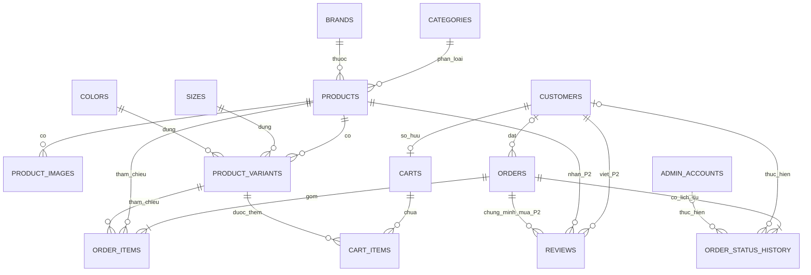

# Đề xuất schema PostgreSQL

> Trạng thái: **Đã duyệt**.
>
> Tài liệu này cụ thể hóa mô hình dữ liệu trong `docs/nghiep-vu.md` v3.2. Chưa có SQL migration hay code nào được tạo từ schema này. Các quyết định tại mục 9 đã được phản ánh vào nghiệp vụ; toàn bộ schema vẫn phải được duyệt trước khi triển khai.

## 1. Phạm vi và quy ước

- Schema mặc định: `public` trên PostgreSQL.
- Khóa chính dùng `bigint GENERATED ALWAYS AS IDENTITY` để không phụ thuộc UUID extension. ID nội bộ không được dùng làm mã đơn công khai.
- Tiền VND dùng `bigint`, không dùng `numeric`, `real` hoặc `double precision`.
- Số lượng và tồn kho dùng `integer`.
- Mọi thời điểm dùng `timestamptz` và lưu theo UTC. Việc nhóm báo cáo chuyển sang `Asia/Ho_Chi_Minh` ở câu truy vấn thống kê (`TK-03`).
- Tên bảng và cột dùng `snake_case`; tên trạng thái lưu bằng mã tiếng Anh ổn định, còn nhãn tiếng Việt do ứng dụng ánh xạ.
- Email được backend chuẩn hóa về chữ thường trước khi lưu. Tên danh mục/thương hiệu/size/màu được so sánh duy nhất không phân biệt hoa thường bằng unique expression index trên `lower(btrim(...))`.
- Mọi chuỗi có giới hạn nghiệp vụ rõ ràng dùng `varchar(n)`; nội dung dài dùng `text`. Backend vẫn phải kiểm tra độ dài, định dạng và chuẩn hóa theo `NF-01`.
- `created_at` có `DEFAULT now()`. `updated_at` được service cập nhật trong cùng thao tác sửa; có thể dùng trigger dùng chung khi viết migration sau này.
- Khóa ngoại mặc định là `ON UPDATE RESTRICT ON DELETE RESTRICT`, trừ khi bảng mô tả khác.
- Unique constraint/unique index đã tự tạo index B-tree tương ứng; danh sách index không lặp lại các index này.
- Bản P1 không tạo bảng hay dữ liệu `reviews`. Bảng đó chỉ là thiết kế dành trước cho P2 và chỉ được đưa vào migration khi người dùng yêu cầu P2.

### Mã trạng thái chuẩn

| Nhóm | Giá trị lưu | Nhãn hiển thị |
|---|---|---|
| Trạng thái đơn | `pending_confirmation` | Chờ xác nhận |
| Trạng thái đơn | `preparing` | Đang chuẩn bị |
| Trạng thái đơn | `shipping` | Đang giao |
| Trạng thái đơn | `delivered` | Đã giao |
| Trạng thái đơn | `completed` | Hoàn thành |
| Trạng thái đơn | `cancelled` | Hủy |
| Loại người đổi trạng thái | `guest`, `customer`, `admin`, `system` | Guest, Customer, Admin, Hệ thống |

Các giá trị trên dùng `varchar` + `CHECK`, không dùng PostgreSQL enum, để việc bổ sung trạng thái trong tương lai không buộc sửa enum. Việc thêm trạng thái vẫn phải sửa `docs/nghiep-vu.md` và có plan được duyệt.

### Mã nhãn trang trí sản phẩm

| Giá trị lưu | Nhãn hiển thị |
|---|---|
| `new` | Mới |
| `bestseller` | Bán chạy |
| `featured` | Nổi bật |

Sản phẩm không gắn nhãn lưu `badge_label = NULL`. Ứng dụng ánh xạ các mã tiếng Anh ổn định ở trên sang nhãn tiếng Việt khi hiển thị, giống cách ánh xạ mã trạng thái đơn (`SP-15`).

## 2. Sơ đồ ER



`ORDER_ITEMS` giữ toàn bộ snapshot để hiển thị đơn cũ; các FK bắt buộc tới `PRODUCTS` và `PRODUCT_VARIANTS` phục vụ truy vết, gộp thống kê và hoàn kho.

## 3. Các bảng P1

### 3.1 `admin_accounts`

| Cột | Kiểu | Null/default | Ràng buộc và ý nghĩa |
|---|---|---|---|
| `id` | `bigint` identity | NOT NULL | PK |
| `full_name` | `varchar(120)` | NOT NULL | `CHECK (btrim(full_name) <> '')` |
| `email` | `varchar(254)` | NOT NULL | Lưu chữ thường; `CHECK (email = lower(email) AND btrim(email) <> '')` |
| `password_hash` | `varchar(255)` | NOT NULL | Chỉ lưu mã băm; `CHECK (btrim(password_hash) <> '')` |
| `deleted_at` | `timestamptz` | NULL | Đề xuất xóa mềm tài khoản admin để giữ audit; xem mục mơ hồ |
| `created_at` | `timestamptz` | NOT NULL, `now()` | Thời điểm tạo |
| `updated_at` | `timestamptz` | NOT NULL, `now()` | Thời điểm sửa gần nhất |

Khóa/ràng buộc:

- `PRIMARY KEY (id)`.
- `UNIQUE (email)`; do email luôn lưu chữ thường nên bảo đảm duy nhất không phân biệt hoa thường (`TKH-07`).
- Điều kiện “không tự xóa” và “không xóa admin cuối cùng” cần service thực hiện trong transaction có khóa phù hợp; `CHECK` không thể so sánh với các dòng khác.

Index:

- Không cần index bổ sung cho đăng nhập: unique index toàn cục của `email` đã đủ. Email admin đã xóa mềm không được cấp lại.

### 3.2 `customers`

| Cột | Kiểu | Null/default | Ràng buộc và ý nghĩa |
|---|---|---|---|
| `id` | `bigint` identity | NOT NULL | PK |
| `full_name` | `varchar(120)` | NOT NULL | `CHECK (btrim(full_name) <> '')` |
| `email` | `varchar(254)` | NOT NULL | Lưu chữ thường |
| `phone` | `varchar(10)` | NOT NULL | Số điện thoại Việt Nam |
| `password_hash` | `varchar(255)` | NOT NULL | Mã băm mật khẩu |
| `default_province` | `varchar(120)` | NULL | Tỉnh/thành mặc định |
| `default_district` | `varchar(120)` | NULL | Quận/huyện mặc định |
| `default_ward` | `varchar(120)` | NULL | Phường/xã mặc định |
| `default_address_line` | `varchar(255)` | NULL | Địa chỉ chi tiết mặc định |
| `created_at` | `timestamptz` | NOT NULL, `now()` | Ngày đăng ký |
| `updated_at` | `timestamptz` | NOT NULL, `now()` | Thời điểm sửa gần nhất |

Khóa/ràng buộc:

- `PRIMARY KEY (id)`.
- `UNIQUE (email)` và `UNIQUE (phone)` (`TKH-01`).
- `CHECK (email = lower(email) AND btrim(email) <> '')`.
- `CHECK (phone ~ '^0[0-9]{9}$')` (`TKH-02`).
- `CHECK (btrim(password_hash) <> '')`.
- Bốn trường địa chỉ mặc định cùng NULL hoặc cùng có giá trị: `CHECK ((default_province IS NULL AND default_district IS NULL AND default_ward IS NULL AND default_address_line IS NULL) OR (default_province IS NOT NULL AND default_district IS NOT NULL AND default_ward IS NOT NULL AND default_address_line IS NOT NULL))`. Khi có giá trị, từng trường còn phải khác chuỗi rỗng sau `btrim`. Điều này tránh lưu địa chỉ mặc định dang dở; checkout vẫn validate lại.
- Không có `deleted_at`, vì xóa/khóa Customer nằm ngoài phạm vi.

Index:

- Unique indexes của `email` và `phone` phục vụ đăng nhập.
- `idx_customers_created_at ON customers (created_at DESC, id DESC)` cho danh sách admin.
- Tìm gần đúng theo tên ở quy mô hiện tại có thể dùng thêm trigram index cùng extension `pg_trgm` đã duyệt tại mục 5 nếu đo hiệu năng thực tế cho thấy cần.

### 3.3 `categories`

| Cột | Kiểu | Null/default | Ràng buộc và ý nghĩa |
|---|---|---|---|
| `id` | `bigint` identity | NOT NULL | PK |
| `name` | `varchar(100)` | NOT NULL | Tên loại giày |
| `created_at` | `timestamptz` | NOT NULL, `now()` | Thời điểm tạo |
| `updated_at` | `timestamptz` | NOT NULL, `now()` | Thời điểm sửa |

Khóa/ràng buộc:

- `PRIMARY KEY (id)`.
- `CHECK (btrim(name) <> '')`.
- Unique expression index `uq_categories_name_ci ON categories (lower(btrim(name)))` (`SP-10`).
- Xóa bị chặn bởi FK từ `products`, kể cả sản phẩm đã xóa mềm (`SP-09`).

### 3.4 `brands`

| Cột | Kiểu | Null/default | Ràng buộc và ý nghĩa |
|---|---|---|---|
| `id` | `bigint` identity | NOT NULL | PK |
| `name` | `varchar(100)` | NOT NULL | Tên thương hiệu |
| `created_at` | `timestamptz` | NOT NULL, `now()` | Thời điểm tạo |
| `updated_at` | `timestamptz` | NOT NULL, `now()` | Thời điểm sửa |

Khóa/ràng buộc:

- `PRIMARY KEY (id)`.
- `CHECK (btrim(name) <> '')`.
- Unique expression index `uq_brands_name_ci ON brands (lower(btrim(name)))` (`SP-10`).
- Xóa bị chặn bởi FK từ `products`, kể cả sản phẩm đã xóa mềm (`SP-09`).

### 3.5 `sizes`

| Cột | Kiểu | Null/default | Ràng buộc và ý nghĩa |
|---|---|---|---|
| `id` | `bigint` identity | NOT NULL | PK |
| `value` | `varchar(30)` | NOT NULL | Giá trị hiển thị, ví dụ `39`, `42.5` |
| `created_at` | `timestamptz` | NOT NULL, `now()` | Thời điểm tạo |
| `updated_at` | `timestamptz` | NOT NULL, `now()` | Thời điểm sửa |

Khóa/ràng buộc:

- `PRIMARY KEY (id)`.
- `CHECK (btrim(value) <> '')`.
- Unique expression index `uq_sizes_value_ci ON sizes (lower(btrim(value)))` (`SP-10`).
- Dùng chuỗi thay vì số để không khóa hệ thống vào một chuẩn size duy nhất.
- Xóa bị chặn bởi FK từ `product_variants` (`SP-09`).

### 3.6 `colors`

| Cột | Kiểu | Null/default | Ràng buộc và ý nghĩa |
|---|---|---|---|
| `id` | `bigint` identity | NOT NULL | PK |
| `name` | `varchar(60)` | NOT NULL | Tên màu |
| `hex_code` | `varchar(7)` | NULL | Mã hiển thị dạng `#RRGGBB` |
| `created_at` | `timestamptz` | NOT NULL, `now()` | Thời điểm tạo |
| `updated_at` | `timestamptz` | NOT NULL, `now()` | Thời điểm sửa |

Khóa/ràng buộc:

- `PRIMARY KEY (id)`.
- `CHECK (btrim(name) <> '')`.
- `CHECK (hex_code IS NULL OR hex_code ~ '^#[0-9A-Fa-f]{6}$')`.
- Unique expression index `uq_colors_name_ci ON colors (lower(btrim(name)))` (`SP-10`).
- Không bắt buộc `hex_code` duy nhất vì nhiều tên nghiệp vụ có thể cùng mã hiển thị.
- Xóa bị chặn bởi FK từ `product_variants` (`SP-09`).

### 3.7 `products`

| Cột | Kiểu | Null/default | Ràng buộc và ý nghĩa |
|---|---|---|---|
| `id` | `bigint` identity | NOT NULL | PK |
| `category_id` | `bigint` | NOT NULL | FK tới `categories.id` |
| `brand_id` | `bigint` | NOT NULL | FK tới `brands.id` |
| `name` | `varchar(200)` | NOT NULL | Tên hiện tại |
| `search_name` | `varchar(200)` | NOT NULL | Tên đã lower/bỏ dấu để tìm kiếm; backend đồng bộ khi đổi tên |
| `slug` | `varchar(240)` | NOT NULL | Slug công khai bất biến |
| `description` | `text` | NULL | Mô tả sản phẩm |
| `material` | `varchar(200)` | NULL | Chất liệu |
| `price` | `bigint` | NOT NULL | Giá bán VND |
| `sale_price` | `bigint` | NULL | Giá khuyến mãi VND |
| `badge_label` | `varchar(20)` | NULL | Nhãn trang trí do admin chọn thủ công (`SP-15`) |
| `deleted_at` | `timestamptz` | NULL | NULL = đang bán; có giá trị = xóa mềm |
| `created_at` | `timestamptz` | NOT NULL, `now()` | Thời điểm tạo |
| `updated_at` | `timestamptz` | NOT NULL, `now()` | Thời điểm sửa |

Khóa/ràng buộc:

- `PRIMARY KEY (id)`.
- `FOREIGN KEY (category_id) REFERENCES categories(id) ON DELETE RESTRICT`.
- `FOREIGN KEY (brand_id) REFERENCES brands(id) ON DELETE RESTRICT`.
- `UNIQUE (slug)`; áp dụng cả sản phẩm đã xóa mềm nên slug không được tái sử dụng (`SP-12`).
- `CHECK (btrim(name) <> '')`.
- `CHECK (btrim(search_name) <> '')`.
- `CHECK (slug ~ '^[a-z0-9]+(?:-[a-z0-9]+)*$')`.
- `CHECK (price > 0)` (`SP-02`).
- `CHECK (sale_price IS NULL OR (sale_price > 0 AND sale_price < price))` (`SP-03`).
- `CHECK (badge_label IN ('new', 'bestseller', 'featured'))` (`SP-15`); `NULL` nghĩa là không gắn nhãn.
- Giá hiệu lực là `COALESCE(sale_price, price)`; không cần lưu cột thứ ba (`SP-04`, `SP-05`).
- Slug do service sinh lúc tạo. Migration nên có trigger `prevent_product_slug_update` để từ chối mọi `UPDATE` làm đổi `slug`, kể cả lỗi code nội bộ (`SP-12`).
- “Ít nhất một ảnh” và “ít nhất một biến thể” là ràng buộc liên bảng; service phải tạo/sửa sản phẩm trong transaction và kiểm tra trước commit (`SP-02`, `SP-06`).

Index:

- `UNIQUE (slug)` đã phục vụ trang chi tiết.
- `idx_products_category_active ON products (category_id, created_at DESC, id DESC) WHERE deleted_at IS NULL`.
- `idx_products_brand_active ON products (brand_id, created_at DESC, id DESC) WHERE deleted_at IS NULL`.
- `idx_products_effective_price_active ON products ((COALESCE(sale_price, price)), id) WHERE deleted_at IS NULL`.
- `idx_products_newest_active ON products (created_at DESC, id DESC) WHERE deleted_at IS NULL`.
- `idx_products_search_name_trgm ON products USING GIN (search_name gin_trgm_ops) WHERE deleted_at IS NULL` cho tìm kiếm không dấu/chứa chuỗi; yêu cầu extension `pg_trgm` đã được duyệt tại mục 5.
- Không tạo index cho `badge_label` ở quy mô hiện tại.

### 3.8 `product_images`

| Cột | Kiểu | Null/default | Ràng buộc và ý nghĩa |
|---|---|---|---|
| `id` | `bigint` identity | NOT NULL | PK |
| `product_id` | `bigint` | NOT NULL | FK tới sản phẩm |
| `image_path` | `varchar(500)` | NOT NULL | Đường dẫn tương đối/tên file ngẫu nhiên |
| `position` | `smallint` | NOT NULL | Thứ tự 1–8; vị trí 1 là ảnh chính |
| `created_at` | `timestamptz` | NOT NULL, `now()` | Thời điểm gắn ảnh |

Khóa/ràng buộc:

- `PRIMARY KEY (id)`.
- `FOREIGN KEY (product_id) REFERENCES products(id) ON DELETE RESTRICT`.
- `CONSTRAINT uq_product_images_product_position UNIQUE (product_id, position) DEFERRABLE INITIALLY DEFERRED`. Constraint được kiểm tra lúc commit để có thể đổi chỗ nhiều ảnh trong cùng transaction mà không vướng trùng vị trí tạm thời.
- `UNIQUE (image_path)` vì tên file upload phải ngẫu nhiên và không dùng chung bản ghi.
- `CHECK (position BETWEEN 1 AND 8)`. Kết hợp unique position, một sản phẩm có tối đa 8 ảnh mà không cần trigger (`SP-11`).
- Service phải bảo đảm sản phẩm luôn có đúng một ảnh vị trí 1 và không có khoảng trống sau khi sắp xếp. Khi gỡ ảnh, xóa bản ghi nhưng không xóa file vật lý (`SP-13`).

Index:

- Unique index của constraint `uq_product_images_product_position` đồng thời phục vụ tải thư viện ảnh đúng thứ tự.

### 3.9 `product_variants`

| Cột | Kiểu | Null/default | Ràng buộc và ý nghĩa |
|---|---|---|---|
| `id` | `bigint` identity | NOT NULL | PK |
| `product_id` | `bigint` | NOT NULL | FK tới sản phẩm |
| `size_id` | `bigint` | NOT NULL | FK tới size |
| `color_id` | `bigint` | NOT NULL | FK tới màu |
| `stock_quantity` | `integer` | NOT NULL, `0` | Tồn kho hiện tại |
| `deleted_at` | `timestamptz` | NULL | Đề xuất xóa mềm biến thể; xem mục mơ hồ |
| `created_at` | `timestamptz` | NOT NULL, `now()` | Thời điểm tạo |
| `updated_at` | `timestamptz` | NOT NULL, `now()` | Thời điểm sửa/tồn kho gần nhất |

Khóa/ràng buộc:

- `PRIMARY KEY (id)`.
- Ba FK tới `products`, `sizes`, `colors` đều `ON DELETE RESTRICT`.
- `UNIQUE (product_id, size_id, color_id)` áp dụng cả biến thể đã xóa để không tạo hai danh tính cho cùng cặp size–màu (`SP-06`). Nếu cần khôi phục, bỏ `deleted_at` trên dòng cũ.
- `CHECK (stock_quantity >= 0)` (`KHO-01`, `KHO-06`).
- Sản phẩm hoặc biến thể đã xóa không khả dụng tại checkout dù còn tồn kho.

Index:

- `idx_product_variants_product_active ON product_variants (product_id, size_id, color_id) WHERE deleted_at IS NULL`.
- `idx_product_variants_size_in_stock ON product_variants (size_id, product_id) WHERE deleted_at IS NULL AND stock_quantity > 0`.
- `idx_product_variants_color_in_stock ON product_variants (color_id, product_id) WHERE deleted_at IS NULL AND stock_quantity > 0`.
- `idx_product_variants_size_color_in_stock ON product_variants (size_id, color_id, product_id) WHERE deleted_at IS NULL AND stock_quantity > 0` cho bộ lọc kết hợp (`KH-04`).

### 3.10 `carts`

| Cột | Kiểu | Null/default | Ràng buộc và ý nghĩa |
|---|---|---|---|
| `id` | `bigint` identity | NOT NULL | PK |
| `customer_id` | `bigint` | NOT NULL | Chủ giỏ; Guest không có dòng ở DB |
| `created_at` | `timestamptz` | NOT NULL, `now()` | Thời điểm tạo |
| `updated_at` | `timestamptz` | NOT NULL, `now()` | Thời điểm thay đổi gần nhất |

Khóa/ràng buộc:

- `PRIMARY KEY (id)`.
- `FOREIGN KEY (customer_id) REFERENCES customers(id) ON DELETE RESTRICT`.
- `UNIQUE (customer_id)` để mỗi Customer có tối đa một giỏ (`GH-04`). Giỏ có thể tạo lười ở lần thêm hàng đầu tiên.

### 3.11 `cart_items`

| Cột | Kiểu | Null/default | Ràng buộc và ý nghĩa |
|---|---|---|---|
| `id` | `bigint` identity | NOT NULL | PK |
| `cart_id` | `bigint` | NOT NULL | FK tới giỏ |
| `product_variant_id` | `bigint` | NOT NULL | FK tới biến thể |
| `quantity` | `integer` | NOT NULL | Số lượng khách muốn mua |
| `created_at` | `timestamptz` | NOT NULL, `now()` | Thời điểm thêm |
| `updated_at` | `timestamptz` | NOT NULL, `now()` | Thời điểm sửa |

Khóa/ràng buộc:

- `PRIMARY KEY (id)`.
- `FOREIGN KEY (cart_id) REFERENCES carts(id) ON DELETE CASCADE`; đây là cascade nội bộ duy nhất hợp lý khi xóa cả giỏ.
- `FOREIGN KEY (product_variant_id) REFERENCES product_variants(id) ON DELETE RESTRICT`.
- `UNIQUE (cart_id, product_variant_id)` (`GH-01`).
- `CHECK (quantity > 0)`.
- Không thể dùng `CHECK (quantity <= stock_quantity)` vì tồn kho nằm ở bảng khác và có thể giảm sau khi thêm giỏ. Service kiểm tra khi thêm/sửa và kiểm tra lại trong transaction checkout (`GH-02`, `GH-03`, `DH-14`).
- Không lưu giá trong giỏ (`GH-05`).

Index:

- Unique index `(cart_id, product_variant_id)` phục vụ tải và gộp giỏ.
- `idx_cart_items_variant ON cart_items (product_variant_id)` hỗ trợ xác định các giỏ bị ảnh hưởng khi biến thể không còn khả dụng.

### 3.12 `orders`

| Cột | Kiểu | Null/default | Ràng buộc và ý nghĩa |
|---|---|---|---|
| `id` | `bigint` identity | NOT NULL | PK nội bộ |
| `order_code` | `varchar(15)` | NOT NULL | Mã công khai, không dùng PK |
| `customer_id` | `bigint` | NULL | NULL với Guest; FK với Customer |
| `recipient_name` | `varchar(120)` | NOT NULL | Snapshot tên người nhận |
| `recipient_phone` | `varchar(10)` | NOT NULL | Snapshot số điện thoại |
| `recipient_province` | `varchar(120)` | NOT NULL | Snapshot tỉnh/thành |
| `recipient_district` | `varchar(120)` | NOT NULL | Snapshot quận/huyện |
| `recipient_ward` | `varchar(120)` | NOT NULL | Snapshot phường/xã |
| `recipient_address_line` | `varchar(255)` | NOT NULL | Snapshot địa chỉ chi tiết |
| `note` | `varchar(1000)` | NULL | Ghi chú của khách |
| `status` | `varchar(32)` | NOT NULL, `pending_confirmation` | Một trong 6 mã trạng thái |
| `subtotal` | `bigint` | NOT NULL | Tổng tiền hàng snapshot |
| `shipping_fee` | `bigint` | NOT NULL | Phí ship snapshot |
| `grand_total` | `bigint` | NOT NULL | Tổng COD snapshot |
| `completed_at` | `timestamptz` | NULL | Chỉ có khi `completed` |
| `created_at` | `timestamptz` | NOT NULL, `now()` | Thời điểm đặt hàng |
| `updated_at` | `timestamptz` | NOT NULL, `now()` | Thời điểm cập nhật gần nhất |

Khóa/ràng buộc:

- `PRIMARY KEY (id)`.
- `UNIQUE (order_code)` (`DH-02`).
- `FOREIGN KEY (customer_id) REFERENCES customers(id) ON DELETE RESTRICT`; không cascade đơn khi xóa Customer.
- `CHECK (order_code ~ '^DH[0-9]{6}-[23456789ABCDEFGHJKMNPQRSTUVWXYZ]{6}$')`.
- Service sinh mã theo `DH` + `yyMMdd` của thời điểm hiện tại tại `Asia/Ho_Chi_Minh` + `-` + 6 ký tự ngẫu nhiên từ bảng `23456789ABCDEFGHJKMNPQRSTUVWXYZ`, ví dụ `DH260921-7K3M9Q`. Khi insert gặp unique violation của `order_code`, service sinh hậu tố mới và retry; mã không dùng hay làm lộ ID nội bộ (`DH-02`).
- Các trường snapshot người nhận đều `CHECK (btrim(...) <> '')`; điện thoại có `CHECK (recipient_phone ~ '^0[0-9]{9}$')` (`DH-06`, `TKH-02`).
- `CHECK (status IN ('pending_confirmation', 'preparing', 'shipping', 'delivered', 'completed', 'cancelled'))`.
- `CHECK (subtotal > 0)`.
- `CHECK (shipping_fee >= 0)`.
- `CHECK (grand_total = subtotal + shipping_fee)` (`DH-05`).
- `CHECK ((status = 'completed' AND completed_at IS NOT NULL) OR (status <> 'completed' AND completed_at IS NULL))` (`TT-03`, `TT-04`).
- Không có cột trạng thái thanh toán; phương thức duy nhất là COD (`DH-04`).
- Thông tin người nhận là bất biến sau khi tạo. Service không cung cấp API sửa; nếu cần bảo vệ ở DB, migration có thể thêm trigger từ chối cập nhật các cột snapshot (`DH-11`).
- “Ít nhất một dòng” và `subtotal = SUM(order_items.line_total)` là ràng buộc liên bảng, phải được service kiểm tra trong transaction tạo đơn.

Index:

- Unique index `order_code` phục vụ tra cứu mã đơn.
- `idx_orders_recipient_phone ON orders (recipient_phone)` theo yêu cầu mục 6.3 của nghiệp vụ.
- `idx_orders_customer_created ON orders (customer_id, created_at DESC, id DESC) WHERE customer_id IS NOT NULL` cho lịch sử Customer.
- `idx_orders_status_created ON orders (status, created_at DESC, id DESC)` cho quản trị đơn.
- `idx_orders_created ON orders (created_at DESC, id DESC)` cho lọc khoảng ngày.
- `idx_orders_completed_at ON orders (completed_at, id) WHERE status = 'completed'` cho thống kê doanh thu.
- Tìm theo tên người nhận có thể dùng trigram index tùy chọn ở mục 5.

### 3.13 `order_items`

| Cột | Kiểu | Null/default | Ràng buộc và ý nghĩa |
|---|---|---|---|
| `id` | `bigint` identity | NOT NULL | PK |
| `order_id` | `bigint` | NOT NULL | FK tới đơn |
| `product_id` | `bigint` | NOT NULL | FK bắt buộc tới sản phẩm; dùng để gộp thống kê |
| `product_variant_id` | `bigint` | NOT NULL | FK bắt buộc tới biến thể; dùng để hoàn kho |
| `product_name` | `varchar(200)` | NOT NULL | Snapshot tên sản phẩm |
| `brand_name` | `varchar(100)` | NOT NULL | Snapshot thương hiệu |
| `size_value` | `varchar(30)` | NOT NULL | Snapshot size |
| `color_name` | `varchar(60)` | NOT NULL | Snapshot màu |
| `image_path` | `varchar(500)` | NOT NULL | Snapshot đường dẫn ảnh chính |
| `unit_price` | `bigint` | NOT NULL | Giá hiệu lực lúc mua |
| `quantity` | `integer` | NOT NULL | Số lượng mua |
| `line_total` | `bigint` | NOT NULL | Thành tiền dòng |
| `created_at` | `timestamptz` | NOT NULL, `now()` | Thời điểm tạo |

Khóa/ràng buộc:

- `PRIMARY KEY (id)`.
- `FOREIGN KEY (order_id) REFERENCES orders(id) ON DELETE RESTRICT`.
- `FOREIGN KEY (product_id) REFERENCES products(id) ON DELETE RESTRICT`.
- `FOREIGN KEY (product_variant_id) REFERENCES product_variants(id) ON DELETE RESTRICT`.
- `UNIQUE (order_id, product_variant_id)`; checkout chỉ có một dòng cho mỗi biến thể.
- Các trường snapshot chuỗi đều `CHECK (btrim(...) <> '')` (`DH-06`).
- `CHECK (unit_price > 0)`.
- `CHECK (quantity > 0)` (`DH-01`).
- `CHECK (line_total = unit_price * quantity)` (`DH-05`).
- Không dùng cascade từ sản phẩm/biến thể; đơn cũ luôn đọc từ snapshot (`SP-08`, `DH-06`).

Index:

- `idx_order_items_order ON order_items (order_id, id)` cho chi tiết đơn.
- `idx_order_items_product ON order_items (product_id)` hỗ trợ truy vết và gộp thống kê bán chạy.
- `idx_order_items_completed_stats` không thể là index trực tiếp theo trạng thái đơn vì trạng thái nằm ở bảng khác; truy vấn thống kê bắt đầu từ partial index `orders(completed_at)` rồi join theo `order_id`.

### 3.14 `order_status_history`

| Cột | Kiểu | Null/default | Ràng buộc và ý nghĩa |
|---|---|---|---|
| `id` | `bigint` identity | NOT NULL | PK |
| `order_id` | `bigint` | NOT NULL | FK tới đơn |
| `from_status` | `varchar(32)` | NULL | NULL cho bản ghi tạo đơn ban đầu (đề xuất) |
| `to_status` | `varchar(32)` | NOT NULL | Trạng thái mới |
| `actor_type` | `varchar(16)` | NOT NULL | `guest`, `customer`, `admin`, `system` |
| `actor_customer_id` | `bigint` | NULL | Có khi actor là Customer |
| `actor_admin_id` | `bigint` | NULL | Có khi actor là Admin |
| `actor_name` | `varchar(120)` | NULL | Snapshot tên hiển thị để audit không đổi theo tài khoản |
| `note` | `varchar(1000)` | NULL | Ghi chú tùy chọn |
| `changed_at` | `timestamptz` | NOT NULL, `now()` | Thời điểm chuyển trạng thái |

Khóa/ràng buộc:

- `PRIMARY KEY (id)`.
- `FOREIGN KEY (order_id) REFERENCES orders(id) ON DELETE RESTRICT`.
- `FOREIGN KEY (actor_customer_id) REFERENCES customers(id) ON DELETE RESTRICT`.
- `FOREIGN KEY (actor_admin_id) REFERENCES admin_accounts(id) ON DELETE RESTRICT`; phù hợp với quy tắc xóa mềm admin.
- `CHECK` cho `from_status` (cho phép NULL) và `to_status` theo cùng 6 giá trị của `orders.status`.
- `CHECK (from_status IS NULL OR from_status <> to_status)`.
- `CHECK (actor_type IN ('guest', 'customer', 'admin', 'system'))`.
- `CHECK` tương quan actor:
  - `customer`: chỉ `actor_customer_id` có giá trị;
  - `admin`: chỉ `actor_admin_id` có giá trị;
  - `guest`/`system`: cả hai ID là NULL.
- Với Guest, `actor_name` có thể là tên người nhận snapshot; với System có thể là `Hệ thống`. Không lưu số điện thoại vào lịch sử để tránh nhân bản dữ liệu cá nhân không cần thiết.
- Lịch sử là append-only: service chỉ `INSERT`, không cung cấp API `UPDATE`/`DELETE`. Migration nên thu hồi quyền sửa/xóa trực tiếp khỏi role ứng dụng nếu mô hình quyền DB cho phép.

Index:

- `idx_order_status_history_order_time ON order_status_history (order_id, changed_at, id)`.
- `idx_order_status_history_to_time ON order_status_history (to_status, changed_at, order_id)` hỗ trợ kiểm tra thời điểm vào `delivered`/`completed` và báo cáo/audit.

## 4. Bảng P2 — chưa đưa vào migration P1

### 4.1 `reviews`

| Cột | Kiểu | Null/default | Ràng buộc và ý nghĩa |
|---|---|---|---|
| `id` | `bigint` identity | NOT NULL | PK |
| `customer_id` | `bigint` | NOT NULL | Người đánh giá |
| `product_id` | `bigint` | NOT NULL | Sản phẩm được đánh giá |
| `order_id` | `bigint` | NOT NULL | Đơn hoàn thành dùng để chứng minh mua hàng |
| `rating` | `smallint` | NOT NULL | Điểm 1–5 |
| `comment` | `varchar(1000)` | NULL | Nhận xét tùy chọn |
| `is_visible` | `boolean` | NOT NULL, `true` | Admin ẩn/hiện |
| `deleted_at` | `timestamptz` | NULL | NULL = còn tồn tại; có giá trị = đã xóa mềm |
| `created_at` | `timestamptz` | NOT NULL, `now()` | Thời điểm đánh giá |

Khóa/ràng buộc:

- `PRIMARY KEY (id)`.
- Ba FK tới `customers`, `products`, `orders`, đều `ON DELETE RESTRICT`.
- `UNIQUE (customer_id, product_id)` (`DG-03`).
- `CHECK (rating BETWEEN 1 AND 5)` (`DG-04`).
- `CHECK (comment IS NULL OR char_length(comment) <= 1000)`.
- `DG-02` là ràng buộc liên bảng: service phải kiểm tra đơn thuộc đúng Customer, trạng thái `completed`, và có `order_items.product_id`/snapshot tương ứng trước khi insert. Việc kiểm tra và insert phải trong cùng transaction.
- Không có `updated_at` vì nghiệp vụ P2 hiện nói không cho sửa đánh giá. Admin “xóa” bằng cách đặt `deleted_at`, không xóa cứng; unique `(customer_id, product_id)` vẫn áp dụng để khách không thể đánh giá lần hai sau khi review bị xóa mềm.

Index:

- `idx_reviews_product_visible_created ON reviews (product_id, created_at DESC, id DESC) WHERE is_visible = true AND deleted_at IS NULL`.
- `idx_reviews_admin_created ON reviews (created_at DESC, id DESC)`.
- Unique index `(customer_id, product_id)` phục vụ kiểm tra đã đánh giá.

## 5. Index tìm kiếm văn bản

Đã duyệt dùng extension chuẩn PostgreSQL `pg_trgm` cùng cột `products.search_name`:

1. Backend tạo `products.search_name` bằng cách trim, chuyển chữ thường và bỏ dấu tiếng Việt mỗi khi tạo/đổi tên.
2. Migration bật extension `pg_trgm` bằng `CREATE EXTENSION IF NOT EXISTS pg_trgm`.
3. Tạo `idx_products_search_name_trgm ON products USING GIN (search_name gin_trgm_ops) WHERE deleted_at IS NULL` để hỗ trợ tìm chứa chuỗi và không dấu.
4. Có thể tạo trigram index tương tự cho `lower(orders.recipient_name)` và `lower(customers.full_name)` nếu đo hiệu năng thực tế cần. Với quy mô vài nghìn dòng, chưa cần tạo quá nhiều index ngay từ đầu.

Không dùng thêm B-tree index trên `lower(name)` vì luồng tìm kiếm sản phẩm dùng `search_name` và GIN trigram. Không dùng `unaccent()` trực tiếp trong generated column/index; backend chịu trách nhiệm chuẩn hóa `search_name`.

## 6. Bất biến liên bảng và transaction

Các điều kiện sau không thể biểu diễn an toàn bằng `CHECK` thông thường; chúng là bắt buộc ở service và phải có test tự động:

### 6.1 Tạo đơn và trừ kho

Toàn bộ thao tác nằm trong **một transaction**:

1. Đọc lại sản phẩm/biến thể đang bán và giá hiệu lực từ DB; không nhận giá từ client (`DH-07`).
2. Gom mỗi biến thể thành một dòng và kiểm tra số lượng dương.
3. Với từng biến thể, trừ kho bằng cập nhật có điều kiện tương đương:

   ```sql
   UPDATE product_variants
   SET stock_quantity = stock_quantity - :quantity,
       updated_at = now()
   WHERE id = :variant_id
     AND deleted_at IS NULL
     AND stock_quantity >= :quantity;
   ```

4. Mỗi lệnh phải cập nhật đúng một dòng. Chỉ cần một dòng cập nhật 0 dòng thì rollback toàn bộ; không đơn, item hay tồn kho nào được giữ lại (`KHO-03`, `DH-14`). Nên xử lý variant theo thứ tự `id` tăng dần để giảm nguy cơ deadlock.
5. Từ giá vừa đọc, tính `line_total`, `subtotal`, lấy phí ship từ biến môi trường của backend, rồi tính `grand_total`; insert `orders` và `order_items` snapshot (`DH-05`, `DH-06`).
6. Insert lịch sử ban đầu từ NULL sang `pending_confirmation` theo `TT-02`.
7. Commit, sau đó mới làm trống giỏ. Nếu việc làm trống giỏ DB thuộc cùng request Customer, có thể đặt trong cùng transaction để tránh trạng thái nửa chừng.

`CHECK (stock_quantity >= 0)` là lớp bảo vệ cuối; cập nhật có điều kiện mới là cơ chế chống bán vượt tồn kho.

### 6.2 Đổi trạng thái và hoàn kho

- Khóa dòng `orders` (`SELECT ... FOR UPDATE`) hoặc dùng conditional update theo trạng thái hiện tại.
- Service chỉ chấp nhận cạnh chuyển trạng thái trong bảng tại mục 5.2 của nghiệp vụ (`TT-01`).
- Cập nhật `orders.status`, đặt `completed_at` khi sang `completed`, insert `order_status_history`, và hoàn kho khi sang `cancelled` trong cùng transaction (`TT-02`, `TT-03`, `KHO-04`).
- Hoàn kho theo `product_variant_id` tăng dần để có thứ tự khóa ổn định. Câu cập nhật dùng ID và **không** lọc `deleted_at`, vì đơn chứa biến thể đã xóa mềm vẫn phải được hoàn kho:

  ```sql
  UPDATE product_variants
  SET stock_quantity = stock_quantity + :quantity,
      updated_at = now()
  WHERE id = :variant_id;
  ```

- Mỗi cập nhật phải tác động đúng một dòng. Do `order_items.product_variant_id` là NOT NULL, FK dùng `ON DELETE RESTRICT`, và `cancelled` là trạng thái cuối, conditional status update bảo đảm biến thể luôn tồn tại và mỗi đơn chỉ hoàn kho một lần.

### 6.3 Tổng tiền và snapshot

- DB tự kiểm tra từng dòng `line_total = unit_price * quantity` và `grand_total = subtotal + shipping_fee`.
- Service kiểm tra `orders.subtotal = SUM(order_items.line_total)` trước commit; không nhận bốn giá trị tiền từ client.
- Snapshot người nhận nằm ở `orders`; snapshot sản phẩm nằm ở `order_items`. Mọi API đọc đơn dùng snapshot, không join dữ liệu hiện tại để thay thế (`DH-06`).
- Đường dẫn ảnh snapshot vẫn dùng được vì gỡ ảnh chỉ xóa bản ghi `product_images`, không xóa file vật lý (`SP-13`).

### 6.4 Tối thiểu một ảnh/biến thể/dòng đơn

- `SP-02`, `SP-06`, `DH-01` là ràng buộc số lượng dòng con. Service phải tạo/sửa trong transaction và kiểm tra trước commit.
- Không nên dùng trigger tức thời vì lúc insert bảng cha, dòng con chưa tồn tại. Deferred constraint trigger có thể làm được nhưng phức tạp không cần thiết cho quy mô đồ án; nếu sau này cho phép nhiều đường ghi ngoài service thì mới cân nhắc.

## 7. Biểu diễn các quy tắc được yêu cầu

### `DH-05` — công thức tiền

- `order_items.unit_price`, `order_items.line_total`, `orders.subtotal`, `orders.shipping_fee`, `orders.grand_total` đều là `bigint` VND.
- `CHECK (unit_price > 0)`, `CHECK (quantity > 0)`, `CHECK (line_total = unit_price * quantity)`.
- `CHECK (subtotal > 0)`, `CHECK (shipping_fee >= 0)`, `CHECK (grand_total = subtotal + shipping_fee)`.
- Quan hệ `subtotal = SUM(line_total)` và việc lấy phí cấu hình được service thực hiện trong transaction. Các giá trị đều được snapshot nên đổi cấu hình phí ship không làm đổi đơn cũ.

### `DH-06` — snapshot đơn hàng

- `orders` lưu riêng tên, điện thoại và bốn phần địa chỉ người nhận.
- `order_items` lưu tên sản phẩm, thương hiệu, size, màu, đường dẫn ảnh chính, đơn giá, số lượng và thành tiền.
- FK `product_id`/`product_variant_id` là bắt buộc và dùng `ON DELETE RESTRICT`; API hiển thị nội dung đơn vẫn luôn dùng snapshot.
- Snapshot người nhận không có API sửa; có thể thêm trigger bất biến khi viết migration.

### `KHO-03` — trừ kho an toàn đồng thời

- `CHECK (stock_quantity >= 0)` ngăn tồn kho âm.
- Service dùng conditional update `... WHERE stock_quantity >= quantity` (hoặc khóa `FOR UPDATE`) và kiểm tra số dòng bị tác động.
- Tất cả cập nhật kho, tạo order, item và history cùng transaction; một dòng thiếu kho làm rollback toàn bộ.
- Thứ tự xử lý variant ổn định và test hai checkout đồng thời là bắt buộc.

### `SP-12` — slug duy nhất và bất biến

- `products.slug NOT NULL UNIQUE` và `CHECK` định dạng chữ thường/dấu gạch ngang.
- Unique áp dụng cả dòng `deleted_at IS NOT NULL`, nên slug của sản phẩm đã xóa không được cấp lại.
- Backend sinh slug từ tên lúc tạo, thử hậu tố `-2`, `-3`... và retry khi gặp unique violation để an toàn đồng thời.
- Đề xuất trigger DB từ chối đổi slug sau insert; admin không có trường sửa slug.

### `TT-02` — lịch sử trạng thái

- Mỗi chuyển trạng thái insert một dòng `order_status_history` gồm `from_status`, `to_status`, `actor_type`, ID actor phù hợp, `actor_name`, `changed_at`, `note`.
- Lịch sử append-only và được insert cùng transaction với cập nhật `orders.status`.
- Hai FK actor tách riêng giúp DB kiểm tra đúng loại tài khoản; Guest/Hệ thống không có ID tài khoản.
- Khi tạo đơn, bắt buộc ghi bản ghi khởi tạo từ NULL sang `pending_confirmation` trong cùng transaction.

## 8. Chính sách xóa và quan hệ khóa ngoại

| Đối tượng | Chính sách đã chốt | Lý do |
|---|---|---|
| Customer | Không xóa | Ngoài phạm vi; bảo toàn giỏ và đơn |
| Admin | Xóa mềm | Giữ danh tính trong audit trạng thái; email không được tái sử dụng |
| Product | Xóa mềm | Bắt buộc bởi `SP-08` |
| Product variant | Xóa mềm, có thể khôi phục đúng dòng cũ | Giữ cart/order ref, thống kê và khả năng hoàn kho |
| Product image record | Xóa cứng bản ghi, giữ file | `SP-13`; snapshot giữ đường dẫn |
| Category/brand/size/color | Chỉ xóa cứng khi không còn FK | `SP-09` |
| Cart | Có thể xóa; items cascade | Dữ liệu tạm của Customer |
| Order/item/history | Không xóa | Chứng từ, snapshot, thống kê và audit |
| Review (P2) | Xóa mềm | Giữ lịch sử; review đã xóa không hiển thị và không cho tạo lại |

## 9. Quyết định cho các điểm đã rà soát

Không thấy mâu thuẫn trực tiếp giữa các quy tắc đã mã hóa. Mười bảy điểm từng còn mơ hồ đã được quyết định như sau:

1. **Lịch sử lúc tạo đơn (`TT-02`) — đã chốt:** ghi một dòng `from_status = NULL`, `to_status = pending_confirmation`, actor là Guest/Customer ngay trong transaction tạo đơn.
2. **Xóa tài khoản Admin (`QT-A06`) và audit — đã chốt:** xóa mềm; email không được tái sử dụng; lịch sử giữ FK và snapshot tên.
3. **Xóa biến thể — đã chốt:** xóa mềm, không xóa cứng; khôi phục bằng cách bỏ `deleted_at` trên đúng dòng cũ.
4. **Mã đơn (`DH-02`) — đã chốt:** `DH` + `yyMMdd` theo `Asia/Ho_Chi_Minh` + `-` + 6 ký tự ngẫu nhiên từ `23456789ABCDEFGHJKMNPQRSTUVWXYZ`; service retry nếu vi phạm unique.
5. **Trường bắt buộc của sản phẩm — đã chốt:** `description` và `material` được phép NULL; các trường bắt buộc khác theo schema và nghiệp vụ.
6. **Chuẩn hóa unique tên (`SP-10`) — đã chốt:** trim và unique không phân biệt hoa thường; không unique theo dạng bỏ dấu.
7. **Size — đã chốt:** dùng `varchar(30)` để hỗ trợ cả size số và chữ/hệ khác.
8. **Ảnh chính khi gỡ/sắp xếp — đã chốt:** service đánh lại vị trí liên tục từ 1, ảnh vị trí 1 là ảnh chính, và từ chối trạng thái không còn ảnh. Unique vị trí là deferred để cho phép hoán đổi trong transaction.
9. **Báo cáo bán chạy (`TK-04`) — đã chốt:** luôn gộp theo `order_items.product_id` bắt buộc; nội dung hiển thị lấy từ snapshot.
10. **Thứ tự đồng hạng top 10 — đã chốt:** tổng số lượng giảm dần, tiếp theo doanh thu tiền hàng giảm dần, rồi `product_id` tăng dần.
11. **Địa chỉ mặc định Customer — đã chốt:** hoặc đủ cả bốn trường, hoặc tất cả NULL.
12. **Độ dài dữ liệu — đã chốt:** duyệt các giới hạn kỹ thuật ghi trong từng bảng của tài liệu này.
13. **Giá trị phí ship mặc định — đã chốt:** backend đọc từ biến môi trường; `orders.shipping_fee` giữ snapshot để thay đổi cấu hình không ảnh hưởng đơn cũ.
14. **P2 — đã chốt phần dữ liệu/thời gian:** tự động hoàn thành sau đúng 168 giờ kể từ lần chuyển sang `delivered`; review dùng xóa mềm. Việc triển khai P2 vẫn thực hiện sau khi P1 chạy ổn theo phạm vi nghiệp vụ.
15. **Tìm không dấu — đã chốt:** dùng `pg_trgm` và `products.search_name`; không tạo B-tree index riêng trên `lower(name)`.
16. **Order item trùng biến thể — đã chốt:** `UNIQUE (order_id, product_variant_id)`; cả `product_id` và `product_variant_id` đều NOT NULL.
17. **Nhãn trang trí sản phẩm (`SP-15`) — đã chốt:** `products.badge_label` nullable, chỉ nhận `new`, `bestseller`, `featured`; admin chọn thủ công và ứng dụng ánh xạ sang nhãn tiếng Việt, không tự tính ở P1.

## 10. Checklist trước khi tạo migration

- [ ] Người dùng duyệt toàn bộ schema.
- [ ] Tạo plan migration theo `docs/plans/_template.md`, liệt kê chính xác bảng/index/trigger sẽ tạo.
- [ ] Chốt thư viện truy cập database và thư viện test trong plan; cập nhật `AGENTS.md` sau khi được duyệt.
- [ ] Viết migration mới; không sửa/xóa migration đã chạy.
- [ ] Viết test constraint, tiền, snapshot, concurrency tồn kho, hoàn kho một lần, trạng thái và thống kê.
- [ ] Chạy migration/test trên PostgreSQL thật trong Docker trước khi commit.
